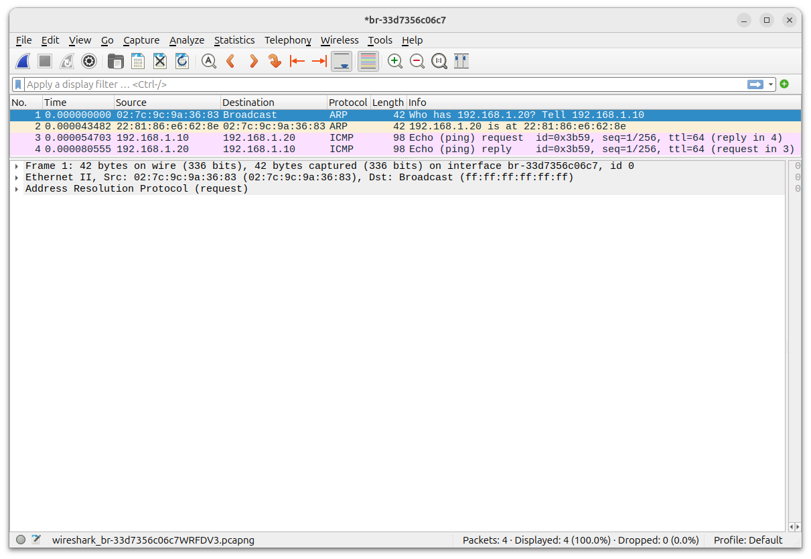
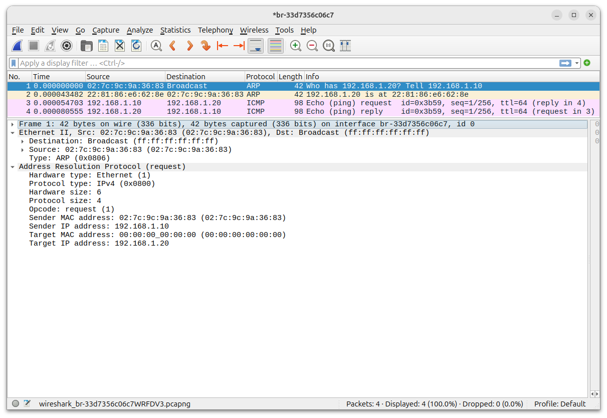
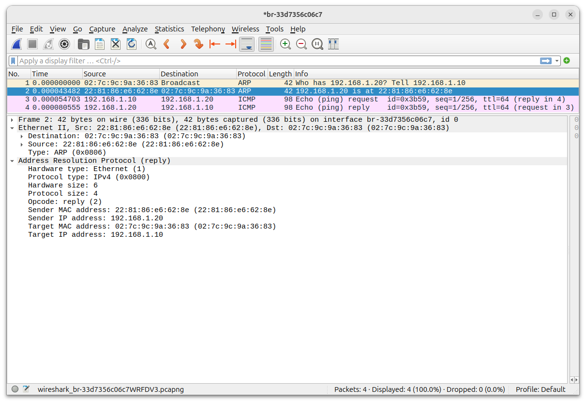

# Laboratório de ARP

Nesse laboratório vamos investigar como os hosts obtém endereço MAC de outros hosts na sua rede e como acessam hosts em outras redes.

## Requisitos

- Docker
- Wireshark

## Bibliografia

- [ARP - RFC 826](https://datatracker.ietf.org/doc/html/rfc826)

## Procedimento

Suba os containers.

No host:

```bash
$ sudo docker compose up -d
```

Resultado esperado:

```bash
$ sudo docker compose up -d
WARN[0000] Docker Compose is configured to build using Bake, but buildx isn't installed 
[+] Building 16.1s (7/7) FINISHED                                              docker:default
 => [server internal] load build definition from Dockerfile     0.1s
 => => transferring dockerfile: 287B                            0.0s
 => [server internal] load metadata for docker.io/library/ubuntu:24.04                                                                                                             0.0s
 => [server internal] load .dockerignore                         0.1s
 => => transferring context: 2B                                  0.0s
 => [server 1/2] FROM docker.io/library/ubuntu:24.04@sha256:33ceb71981b602c1a7443a53469e4dba065f7503eab3078a2d7a57a2ab987517                                                       0.1s
 => => resolve docker.io/library/ubuntu:24.04@sha256:33ceb71981b602c1a7443a53469e4dba065f7503eab3078a2d7a57a2ab987517                                                              0.0s
 => [server 2/2] RUN apt-get update &&     apt-get install -y         iproute2         iputils-ping         net-tools         tcpdump         &&     rm -rf /var/lib/apt/lists/*  14.6s
 => [server] exporting to image                                  1.0s 
 => => exporting layers                                          0.6s 
 => => exporting manifest sha256:3b4b9d7053d105ef03e015cf198f756ca3c7ec6f217220073dc7fd8b3a140208                                                                                  0.0s 
 => => exporting config sha256:aa312b782c269ccb4ab3528c6498012a72b8b21653c568a699d8af902cfcc5b7                                                                                    0.0s 
 => => exporting attestation manifest sha256:e81090d700e35d6479c2c7bf66ba463cd2f73046cbc9645e5e93716fea4b2f45                                                                      0.1s 
 => => exporting manifest list sha256:0e4de5400f28bee76e9406c4a2b0907f3a8e41ca26c01e85eacf845019f76802                                                                             0.0s 
 => => naming to docker.io/library/arp-server:latest             0.0s
 => => unpacking to docker.io/library/arp-server:latest          0.2s
 => [server] resolving provenance for metadata file              0.0s
[+] Running 5/5
 ✔ server                 Built                                  0.0s 
 ✔ Network arp_arp-net    Created                                0.1s 
 ✔ Container arp-client2  Started                                0.5s 
 ✔ Container arp-client1  Started                                0.5s 
 ✔ Container arp-server   Started                                0.5s 
```

Verifique se os containers subiram.

No host:

```bash
$ sudo docker ps -a
```

Resultado esperado:

```bash
$ sudo docker ps -a
CONTAINER ID   IMAGE                      COMMAND       CREATED         STATUS         PORTS     NAMES
e60733007556   arp-server                 "/bin/bash"   9 seconds ago   Up 9 seconds             arp-server
cdb4a100b67e   meslin/arp-client:latest   "/bin/bash"   9 seconds ago   Up 9 seconds             arp-client1
8ec1cad9f791   meslin/arp-client:latest   "/bin/bash"   9 seconds ago   Up 9 seconds             arp-client2
```

Opcionalmente, verifique as redes.

No host:

```bash
 sudo docker network ls
NETWORK ID     NAME          DRIVER    SCOPE
ef411ff7de56   arp_arp-net   bridge    local
340a21aece36   bridge        bridge    local
1b5be87839cd   host          host      local
97f519bf0843   none          null      local
```

### Início da Captura


Entre no cliente 1.

No host:

```bash
$ sudo docker compose exec client1 bash
```

Resultado esperado:

```bash
$ sudo docker compose exec client1 bash
root@cdb4a100b67e:/# 
```

Verifique o endereço IP.

No cliente 1:

```
root@cdb4a100b67e:/# ifconfig eth0
```

Resultado esperado

```
root@af453b5aab70:/# ifconfig eth0
eth0: flags=4163<UP,BROADCAST,RUNNING,MULTICAST>  mtu 1500
        inet 192.168.1.10  netmask 255.255.255.0  broadcast 192.168.1.255
        ether 02:7c:9c:9a:36:83  txqueuelen 0  (Ethernet)
        RX packets 97  bytes 14772 (14.7 KB)
        RX errors 0  dropped 0  overruns 0  frame 0
        TX packets 6  bytes 308 (308.0 B)
        TX errors 0  dropped 0 overruns 0  carrier 0  collisions 0
```

Verifique agora a tabela ARP. Provavelmente estará vazia.

No cliente 1:

```
root@cdb4a100b67e:/# ip neigh
```

Antes de iniciar a captura, veja o nome da rede.

No cliente 1 (substitua o nome da rede pelo nome da sua rede):

```bash
$ sudo docker network inspect arp_arp-net
```

Resultado esperado:

```bash
$ sudo docker network inspect arp_arp-net
[
    {
        "Name": "arp_arp-net",
        "Id": "ef411ff7de56a2bd862b9b11e556c74f591aa665c206c546355704958d96e3c2",
        "Created": "2026-09-13T18:13:54.586949374-03:00",
        "Scope": "local",
        "Driver": "bridge",
        "EnableIPv4": true,
        "EnableIPv6": false,
        "IPAM": {
            "Driver": "default",
            "Options": null,
            "Config": [
                {
                    "Subnet": "192.168.1.0/24",
                    "IPRange": "",
                    "Gateway": "192.168.1.1"
                }
            ]
        },
        "Internal": false,
        "Attachable": false,
        "Ingress": false,
        "ConfigFrom": {
            "Network": ""
        },
        "ConfigOnly": false,
        "Options": {},
        "Labels": {
            "com.docker.compose.config-hash": "bff2868b5f812404c30c03af39506520c2b49cdbb7d154a2ec03101e31d952bb",
            "com.docker.compose.network": "arp-net",
            "com.docker.compose.project": "arp",
            "com.docker.compose.version": "2.40.3"
        },
        "Containers": {},
        "Status": {
            "IPAM": {
                "Subnets": {
                    "192.168.1.0/24": {
                        "IPsInUse": 3,
                        "DynamicIPsAvailable": 253
                    }
                }
            }
        }
    }
]
```

Através do Wireshark, inicie a captura na interface de rede `br-ef411ff7de56`. Substitua pela sua interface, vista um pouco acima, mas apenas os 12 primeiros caracteres do `Id`.

Troque algum datagrama com o cliente 2, por exemplo, um ping.

No cliente 1:

```
root@af453b5aab70:/# ping -c 1 192.168.1.20
```

Resultado esperado:

```
root@af453b5aab70:/# ping -c 1 192.168.1.20
PING 192.168.1.20 (192.168.1.20) 56(84) bytes of data.
64 bytes from 192.168.1.20: icmp_seq=1 ttl=64 time=0.124 ms

--- 192.168.1.20 ping statistics ---
1 packets transmitted, 1 received, 0% packet loss, time 0ms
rtt min/avg/max/mdev = 0.124/0.124/0.124/0.000 ms
```

### Término da captura

Termine a captura no Wireshark.



### Examine os resultados

Examine a tabela ARP do cliente 1.

No cliente 1:

```
root@af453b5aab70:/# ip neigh
```

Resultado esperado:

```
root@af453b5aab70:/# ip neigh
192.168.1.20 dev eth0 lladdr 22:81:86:e6:62:8e DELAY 
```
Entendendo da tabela ARP do cliente 1:
- 192.168.1.20 - endereço IP do vizinho
- dev eth0 -- interface pela qual o vizinho é alcançado
- lladdr --- Link Layer Address
- 22:81:86:e6:62:8e - endereço MAC do vizinho
- DELAY - (ou REACHABLE ou STALE) indica o estado da entrada na tabela como "a confirmar", "confirmado" ou "antigo"

#### ARP Request



Veja o envio do pedido de ARP vindo do cliente 1.
Observe:
- Endereço MAC de origem deve ser igual ao MAC obtido anteriormente
- Endereço MAC de destino é de broadcast
- Não há camada IP ou TCP

#### ARP Reply



Observe:
- Endereço MAC de origem é o MAC do cliente 2
- Endereço MAC de destino agora é o endereço MAC do cliente 1, ou seja, a mensagem é unicast
- Também não há camadas superiores
- O *payload* contém o endereço IP do cliente 2