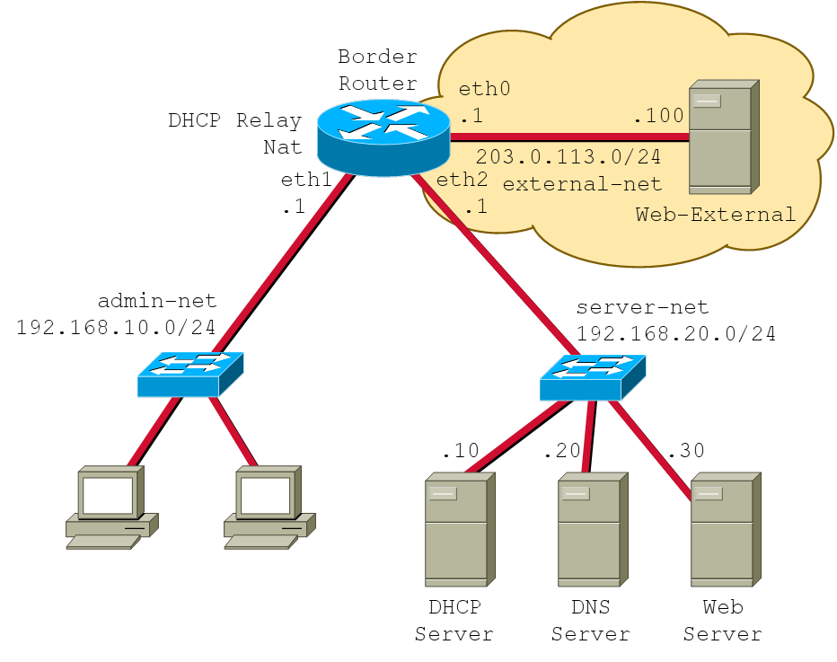

# Exercício Final

## Topologia

### Redes

| Nome | IP |
|------|:----:|
| admin-net | 192.168.10.0/24 |
| server-net | 192.168.20.0/24 |
| external-net | 203.0.113.0/24 |

### Servers

Nome | IP
---|:---:
dhcp-server | 192.168.20.10
dns-server | 192.168.20.20
web-server | 192.168.20.30

### Router

Interface | IP
---|:---:
eth0 | 203.0.113.1/24
eth1 | 192.169.10.1/24
eth2 | 192.168.20.2/24

## Procedimento

