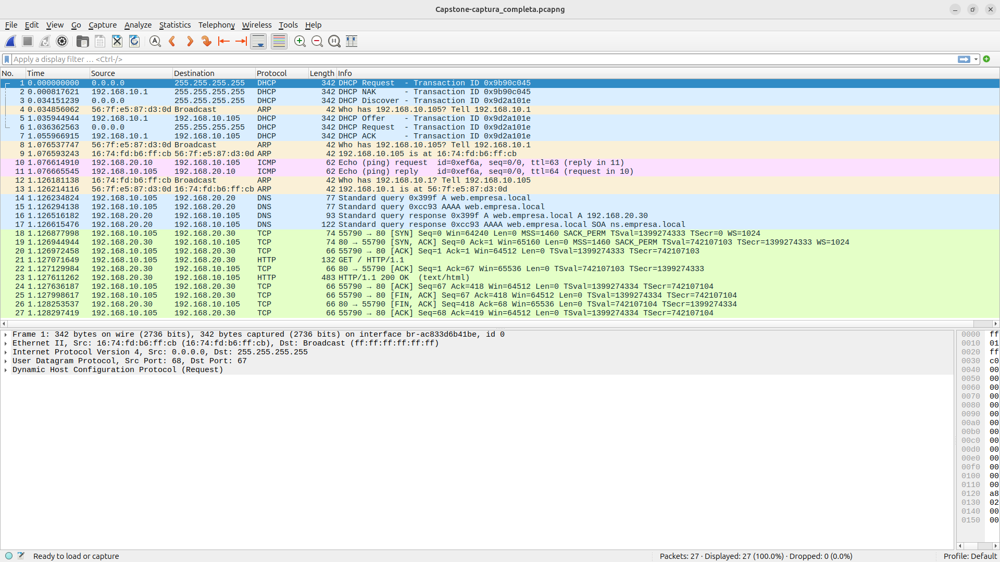

# Exercício Final

## Topologia


### Redes

| Nome | IP |
|------|:----:|
| admin-net | 192.168.10.0/24 |
| server-net | 192.168.20.0/24 |
| external-net | 203.0.113.0/24 |

### Servers

Nome | IP
---|:---:
dhcp-server | 192.168.20.10
dns-server | 192.168.20.20
web-server | 192.168.20.30


### Router

Interface | IP
---|:---:
eth0 | 203.0.113.1/24
eth1 | 192.169.10.1/24
eth2 | 192.168.20.2/24

## Procedimento

### Endereço IP dos servidores

Entre nos servidores de DNS e Web e faça com que eles obtenham endereço IP e outras opções via servidor de DHCP interno.
Monitore as opeações.
Verifique se o endereçamento IP está de acordo com a documentação.

Comando para entrar nos servidores:

```bash
$ sudo docker exec -it web-server bash
$ sudo docker exec -it dns-server bash
```

Comando para obter endereço IP pelo cliente DHCP:

```
# dhclient -v eth0
```

### Endereço IP dos clientes

Entre em cada cliente e obtenha configuração IP via DHCP.
Monitore a transação.

Comando para entrar nos clientes:

```bash
$ sudo docker exec -it client1 bash
$ sudo docker exec -it client2 bash
```

Comando para obter endereço IP pelo cliente DHCP:

```
# dhclient -v eth0
```

> [!WARNING]  
> Não acesse o servidor web agora para testarmos a sequência completa em breve.

### Teste de Conectividade

Verifique se os três servidores conseguem se falar e falar com o servidor externo através de `ping`.
Você deve ser capaz de acessar os servidores internos pelo nome.

> [!WARNING]  
> Lembre-se que não existe resolução de nome para o servidor externo.

### Acesso aos serviços

Verifique o acesso HTTP ao servidor externo utilizando o aplicativo `curl`.

> [!WARNING]  
> O aplicativo `curl` não está instalado no servidor DHCP.

```
# curl http://203.0.113.100
```

Verifique também se o servidor externo consegue acessar o servidor web interno através do endereço IP do roteador de borda na porta 80.

### **O TESTE DE SERVIÇO**

> [!INFO]  
> Se alguma etapa do teste falhar, reinicie o cliente: `$ sudo docker compose restart client1`.

> [!WARNING]  
> Esse teste deve ser feito antes do cliente acessar o servidor web pela primeira vez.
> Se ele já tiver feito o acesso, reinicie o cliente.

Limpe a tabela ARP do cliente 1:

```
# ip neigh flush dev eth0
```

Verifique se a tabela realmente está vazia:

```
# ip neigh
```

Monitore o acesso do cliente 1 ao servidor web local usando o Wireshark.



Explique cada um dos pacotes capturados.

## Comandos Importantes

```bash
$ sudo docker compose build --no-cache web-server
```

```bash
$ sudo docker exec -it web-server bash
```
