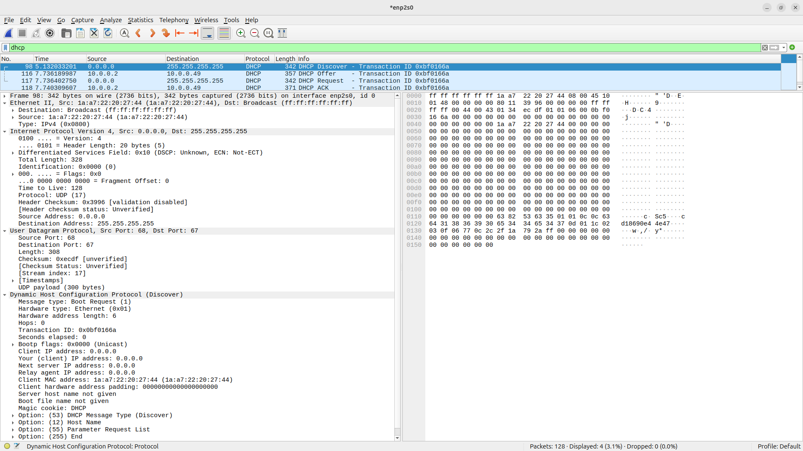
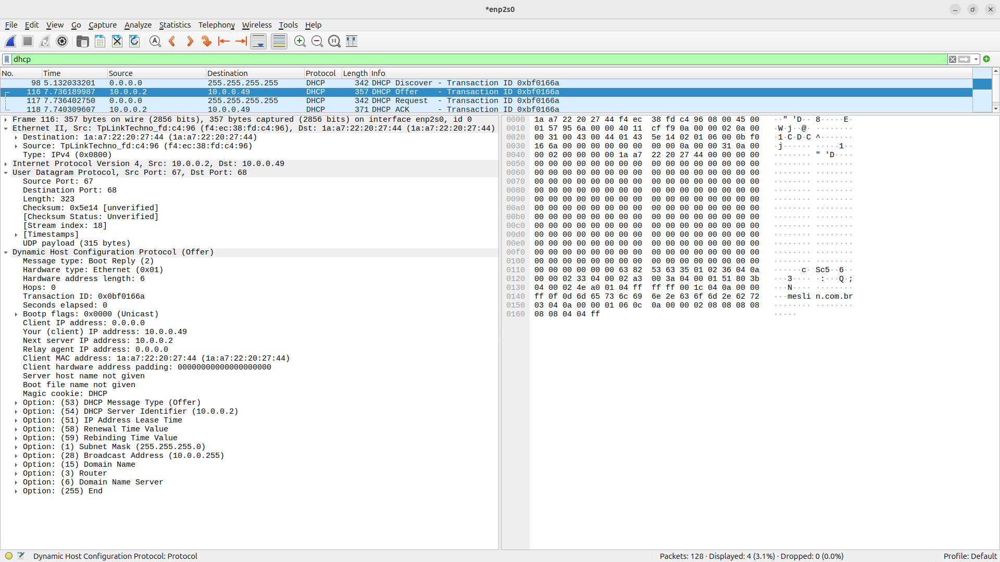
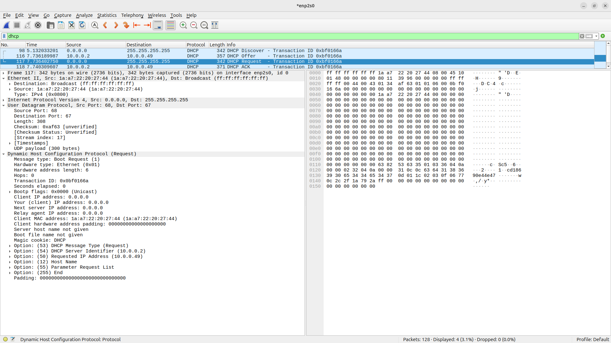
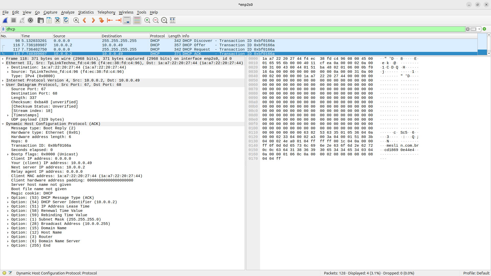

# Laboratório de DHCP

Nesse laboratório, vamos investigar como os hosts obtém o seu endereço IPv4, sua máscara de rede, endereço de gateway e outras configurações iniciais.

# Requisitos

- Docker
- Wireshark

Opcionalmente você vai querer instalar alguns pacotes interessantes no seu container Ubuntu:

```bash
apt update
apt install -y net-tools iputils-ping
```

# Procedimento

## Nome da interface **ethernet**

No seu computador (host), verifique o nome da sua interface de rede **ethernet** com o comando:

```bash
$ ip link
```

Por exemplo:

```bash
$ ip link
1: lo: <LOOPBACK,UP,LOWER_UP> mtu 65536 qdisc noqueue state UNKNOWN mode DEFAULT group default qlen 1000
    link/loopback 00:00:00:00:00:00 brd 00:00:00:00:00:00
2: enp2s0: <BROADCAST,MULTICAST,UP,LOWER_UP> mtu 1500 qdisc fq_codel state UP mode DEFAULT group default qlen 1000
    link/ether 54:bf:64:10:21:86 brd ff:ff:ff:ff:ff:ff
5: enx28ee521160ec: <NO-CARRIER,BROADCAST,MULTICAST,UP> mtu 1500 qdisc fq_codel state DOWN mode DEFAULT group default qlen 1000
    link/ether 28:ee:52:11:60:ec brd ff:ff:ff:ff:ff:ff
6: wlo1: <BROADCAST,MULTICAST,UP,LOWER_UP> mtu 1500 qdisc noqueue state UP mode DORMANT group default qlen 1000
    link/ether 7c:76:35:f4:c2:07 brd ff:ff:ff:ff:ff:ff
    altname wlp0s20f3
7: br-dee386f79b90: <NO-CARRIER,BROADCAST,MULTICAST,UP> mtu 1500 qdisc noqueue state DOWN mode DEFAULT group default 
    link/ether 82:32:d6:2a:05:9e brd ff:ff:ff:ff:ff:ff
8: br-328e39d774b5: <NO-CARRIER,BROADCAST,MULTICAST,UP> mtu 1500 qdisc noqueue state DOWN mode DEFAULT group default 
    link/ether 16:a5:ad:df:4a:1c brd ff:ff:ff:ff:ff:ff
9: docker0: <NO-CARRIER,BROADCAST,MULTICAST,UP> mtu 1500 qdisc noqueue state DOWN mode DEFAULT group default 
    link/ether 36:3a:32:8c:52:d8 brd ff:ff:ff:ff:ff:ff
10: br-7eaf91072c1c: <NO-CARRIER,BROADCAST,MULTICAST,UP> mtu 1500 qdisc noqueue state DOWN mode DEFAULT group default 
    link/ether 26:8d:de:75:51:57 brd ff:ff:ff:ff:ff:ff
11: br-a797b57d1a66: <NO-CARRIER,BROADCAST,MULTICAST,UP> mtu 1500 qdisc noqueue state DOWN mode DEFAULT group default 
    link/ether 12:74:1a:57:be:b0 brd ff:ff:ff:ff:ff:ff
89: enx803f5d09de70: <NO-CARRIER,BROADCAST,MULTICAST,UP> mtu 1500 qdisc fq_codel state DOWN mode DEFAULT group default qlen 1000
    link/ether 80:3f:5d:09:de:70 brd ff:ff:ff:ff:ff:ff
```

Uma interface ethernet tem o formato do nome com `enpXXX` ou `ethXXX`
Nesse caso, o nome da interface ethernet é `enp2s0`

## Endereço da interface

Verifique o endereço IPv4 da sua interface ethernet (substitua `enp2s0` pelo nome da sua interface):

```bash
$ ip -4 addr show dev enp2s0
```

Por exemplo:

```bash
$ ip -4 addr show dev enp2s0
2: enp2s0: <BROADCAST,MULTICAST,UP,LOWER_UP> mtu 1500 qdisc fq_codel state UP group default qlen 1000
    inet 10.0.0.199/24 brd 10.0.0.255 scope global dynamic noprefixroute enp2s0
       valid_lft 163132sec preferred_lft 163132sec
```

Nesse caso, o endereço da interface é `10.0.0.199` com máscara `/24` (`255.255.255.0`)

## Informações de roteamento

Use o comando a seguir para obter informações sobre o roteamento, principalmente sobre o `default gateway` da rede conectada à interface ethernet:

```bash
$ ip route
```

Por exemplo:

```bash
$ ip route
default via 10.0.0.1 dev enp2s0 proto dhcp src 10.0.0.199 metric 100 
default via 10.0.0.1 dev wlo1 proto dhcp src 10.0.0.146 metric 600 
10.0.0.0/24 dev enp2s0 proto kernel scope link src 10.0.0.199 metric 100 
10.0.0.0/24 dev wlo1 proto kernel scope link src 10.0.0.146 metric 600 
172.17.0.0/16 dev docker0 proto kernel scope link src 172.17.0.1 linkdown 
172.18.0.0/16 dev br-328e39d774b5 proto kernel scope link src 172.18.0.1 linkdown 
172.19.0.0/16 dev br-dee386f79b90 proto kernel scope link src 172.19.0.1 linkdown 
172.20.0.0/16 dev br-7eaf91072c1c proto kernel scope link src 172.20.0.1 linkdown 
172.21.0.0/16 dev br-a797b57d1a66 proto kernel scope link src 172.21.0.1 linkdown 
```

Nesse caso, o default gateway é `10.0.0.1`

## Crie a rede *macvlan*

Uma macvlan é uma tecnologia do Linux que permite criar interfaces de rede virtuais com endereços MAC próprios, associadas a uma interface física existente.

No Docker, ela permite que um container apareça na rede física como se fosse um dispositivo independente, em vez de ficar atrás da rede bridge do Docker.

Para criar a sua rede macvlan, substitua os valores de subnet, gateway e parent pelos valores que você obteve nos passos anteriores

```bash
$ sudo docker network create \
    -d macvlan \
    --subnet=10.0.0.0/24 \
    --gateway=10.0.0.1 \
    -o parent=enp2s0 \
    dhcp-net
```

## Criando o container

Crie um container com uma imagem Ubuntu.
Esse container precisa ser criado com permissões especiais para uso de rede.

```bash
$ sudo docker run --rm -it \
    --network dhcp-net \
    --cap-add=NET_ADMIN \
    --cap-add=NET_RAW \
    --entrypoint /bin/bash \
    ubuntu:latest
```

No container, instale os requisitos:

```bash
apt update
apt install -y isc-dhcp-client
```

## Iniciando a captura com o Wireshark

No seu host, abra o Wireshark.
Selecione a sua interface ethernet (no exemplo, usamos a interface `enp2s0`).
Comece a captura.

No container, digite o seguinte comando: 

```bash
dhclient -v eth0
```

Resultado esperado: 

```bash
Internet Systems Consortium DHCP Client 4.4.3-P1
Copyright 2004-2022 Internet Systems Consortium.
All rights reserved.
For info, please visit https://www.isc.org/software/dhcp/

Listening on LPF/eth0/1a:a7:22:20:27:44
Sending on   LPF/eth0/1a:a7:22:20:27:44
Sending on   Socket/fallback
xid: warning: no netdev with useable HWADDR found for seed's uniqueness enforcement
xid: rand init seed (0x6a8552ff) built using gethostid
DHCPDISCOVER on eth0 to 255.255.255.255 port 67 interval 3 (xid=0xbf0166a)
DHCPOFFER of 10.0.0.49 from 10.0.0.2
DHCPREQUEST for 10.0.0.49 on eth0 to 255.255.255.255 port 67 (xid=0x6a16f00b)
DHCPACK of 10.0.0.49 from 10.0.0.2 (xid=0xbf0166a)
bound to 10.0.0.49 -- renewal in 86215 seconds.
```

No seu computador host, pare a captura do Wireshark.
Use `DHCP` como filtro e examine os pacotes capturados.

# Resultados

## DHCP Discover



## DHCP Offer



## DHCP Request



## DHCP ACK



## Dados obtidos

Liste os dados obtidos pelo seu container Ubuntu via DHCP:
- Endereço IP
- Máscara de rede
- Default Gateway
- Lease time
- Endereço de broadcast
- Nome do domínio
- Servidor de DNS
