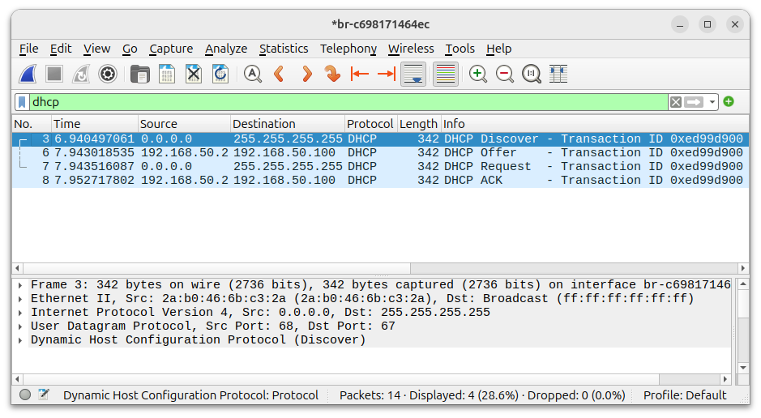
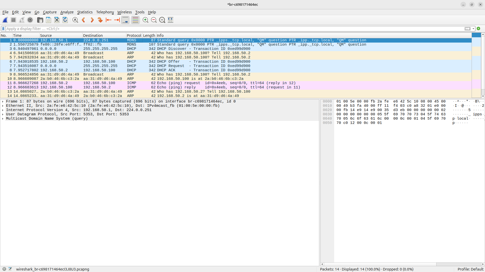

# Laboratório de DHCP

Nesse laboratório vamos investigar como os hosts obtém o seu endereço IPv4, sua máscara de rede, endereço de gateway e outras configurações iniciais.

## Requisitos

- Docker
- Wireshark

## Bibliografia

- [DHCP RFC2131](https://datatracker.ietf.org/doc/html/rfc9051)

## Procedimento

Suba os containers:

```bash
$ sudo docker compose up -d
```

Resultado esperado:

```bash
$ sudo docker compose up -d
[+] Running 3/3
 ✔ Network dhcp_dhcp-net  Created                             0.0s 
 ✔ Container dhcp-server  Started                             0.4s 
 ✔ Container dhcp-client  Started                             0.4s 
```

Verifique se os containers estão no ar:

```bash
$ sudo docker ps -a
```

Resultado esperado:

```bash
$ sudo docker ps -a
CONTAINER ID   IMAGE                       COMMAND                  CREATED          STATUS          PORTS     NAMES
c2aae4d145f9   meslin/dhcp-server:latest   "dhcpd -f -d --no-pi…"   27 seconds ago   Up 26 seconds             dhcp-server
7144f14720e8   meslin/dhcp-client:latest   "/bin/bash"              27 seconds ago   Up 26 seconds             dhcp-client
```

Verifique as redes existentes:

```bash
$ sudo docker network ls
```

Resultado esperado:

```bash
$ sudo docker network ls
NETWORK ID     NAME            DRIVER    SCOPE
626fb2ea3cb6   bridge          bridge    local
c698171464ec   dhcp_dhcp-net   bridge    local
1b5be87839cd   host            host      local
97f519bf0843   none            null      local
```

Verifique também a rede que foi criada:

```bash
$ sudo docker network inspect dhcp_dhcp-net
```

Resultado esperado:

```bash
$ sudo docker network inspect dhcp_dhcp-net
[
    {
        "Name": "dhcp_dhcp-net",
        "Id": "c749a7d4d53bb2f1a7761d98629a5c1f66a2d33279c3f135d00e0fd488f0894a",
        "Created": "2026-09-04T22:58:12.311967379-03:00",
        "Scope": "local",
        "Driver": "bridge",
        "EnableIPv4": true,
        "EnableIPv6": false,
        "IPAM": {
            "Driver": "default",
            "Options": null,
            "Config": [
                {
                    "Subnet": "192.168.50.0/24",
                    "IPRange": "",
                    "Gateway": "192.168.50.1"
                }
            ]
        },
        "Internal": true,
        "Attachable": false,
        "Ingress": false,
        "ConfigFrom": {
            "Network": ""
        },
        "ConfigOnly": false,
        "Options": {},
        "Labels": {
            "com.docker.compose.config-hash": "368028f1effe8db5d65d97c989da94d87b380cf7dbc77cea042d2d0dfb1ed3e6",
            "com.docker.compose.network": "dhcp-net",
            "com.docker.compose.project": "dhcp",
            "com.docker.compose.version": "2.40.3"
        },
        "Containers": {
            "7144f14720e8b2f38fc1c6037416cb57cdcfbd3cc318cc2e8b417ecd32152c12": {
                "Name": "dhcp-client",
                "EndpointID": "485c0eb2725acad3b1cee1f94e56080f65b94dc127c95345588b831d1dbd111f",
                "MacAddress": "6a:da:c8:38:95:25",
                "IPv4Address": "192.168.50.3/24",
                "IPv6Address": ""
            },
            "c2aae4d145f9aa5d6774478069921e02c0dea2f73add0a2e604a6d848f66ba1e": {
                "Name": "dhcp-server",
                "EndpointID": "a6804103a37523d66c36c0360880926dc16c2dcced654f067087b7623e58f037",
                "MacAddress": "56:53:1a:3c:f5:7c",
                "IPv4Address": "192.168.50.2/24",
                "IPv6Address": ""
            }
        },
        "Status": {
            "IPAM": {
                "Subnets": {
                    "192.168.50.0/24": {
                        "IPsInUse": 5,
                        "DynamicIPsAvailable": 251
                    }
                }
            }
        }
    }
]
```

No exemplo, o servidor tem o endereço IP 192.168.50.2/24 e o cliente, 192.168.50.3/24.

Anote os 12 primeiros caracteres do ID da rede.
Nesse exemplo, o ID é "Id": "c749a7d4d53bb2f1a7761d98629a5c1f66a2d33279c3f135d00e0fd488f0894a".
O nome da rede Linux criada é formada por `br-<12 primeiros caracteres>`, ou seja, `br-c749a7d4d53b`.
Verifique o seu nome de rede para poder iniciar a captura com o Wireshark.

### Início da Captura

Através do Wireshark, inicie a captura na interface de rede `br-c749a7d4d53b` (substitua pela sua interface, vista um pouco acima).

### Obtendo Endereço IP via DHCP

Entre no container cliente.

No host:

```bash
$ sudo docker exec -it dhcp-client bash
```

No container do cliente, verifique o endereço IP atribuido pelo Docker:

No cliente:

```bash
root@dhcp-client:/# ip addr show eth0
```

Resultado esperado:

```bash
root@dhcp-client:/# ip addr show eth0
2: eth0@if65: <BROADCAST,MULTICAST,UP,LOWER_UP> mtu 1500 qdisc noqueue state UP group default 
    link/ether 6a:da:c8:38:95:25 brd ff:ff:ff:ff:ff:ff link-netnsid 0
    inet 192.168.50.3/24 brd 192.168.50.255 scope global eth0
       valid_lft forever preferred_lft forever
```

Neste exemplo, o cliente está com endereço IP 192.168.50.3.
Agora vamos remover o endereço atribuido pelo Docker e obter um novo endereço IP através de DHCP usando o nosso servidor.

No cliente, execute os dois comandos a seguir:

```bash
root@dhcp-client:/# ip addr flush dev eth0
root@dhcp-client:/# ip route flush dev eth0
```

Verifique agora o estado da interface de rede:

```bash
root@dhcp-client:/# ip addr show eth0
```

Veja que a interface não tem mais endereço IP.

Resultado esperado:

```bash
root@dhcp-client:/# ip addr show eth0
2: eth0@if76: <BROADCAST,MULTICAST,UP,LOWER_UP> mtu 1500 qdisc noqueue state UP group default 
    link/ether b2:31:65:5d:ea:a7 brd ff:ff:ff:ff:ff:ff link-netnsid 0
```

Busque um novo endereço IP via DHCP.

No cliente:

```bash
root@dhcp-client:/# dhclient -v eth0
```

Resultado esperado:

```bash
root@dhcp-client:/# dhclient -v eth0
Internet Systems Consortium DHCP Client 4.4.3-P1
Copyright 2004-2022 Internet Systems Consortium.
All rights reserved.
For info, please visit https://www.isc.org/software/dhcp/

Listening on LPF/eth0/b2:31:65:5d:ea:a7
Sending on   LPF/eth0/b2:31:65:5d:ea:a7
Sending on   Socket/fallback
xid: warning: no netdev with useable HWADDR found for seed's uniqueness enforcement
xid: rand init seed (0xc25b7829) built using gethostid
DHCPDISCOVER on eth0 to 255.255.255.255 port 67 interval 3 (xid=0x6db82574)
DHCPOFFER of 192.168.50.100 from 192.168.50.2
DHCPREQUEST for 192.168.50.100 on eth0 to 255.255.255.255 port 67 (xid=0x7425b86d)
DHCPACK of 192.168.50.100 from 192.168.50.2 (xid=0x6db82574)
bound to 192.168.50.100 -- renewal in 280 seconds.
```

Verifique novamente o estado da interface ethernet.

No cliente:

```bash
root@dhcp-client:/# ip addr show eth0
```

Resultado esperado:

```bash
root@dhcp-client:/# ip addr show eth0
2: eth0@if76: <BROADCAST,MULTICAST,UP,LOWER_UP> mtu 1500 qdisc noqueue state UP group default 
    link/ether b2:31:65:5d:ea:a7 brd ff:ff:ff:ff:ff:ff link-netnsid 0
    inet 192.168.50.100/24 brd 192.168.50.255 scope global dynamic eth0
       valid_lft 504sec preferred_lft 504sec
```

Veja que agora o cliente tem endereço IP 192.168.50.100/24.

### Término da captura

Termine a captura no Wireshark.

### Verificação no Servidor

Confirme que o servidor realmente forneceu um endereço IP ao cliente.

No host, entre no container do servidor DHCP:

```bash
$ sudo docker exec -it dhcp-server bash
```

Resultado esperado:

```bash
$ sudo docker exec -it dhcp-server bash
root@dhcp-server:/#
```

Liste o arquivo `dhcpd.leases` para verificar quais endereÇos IP foram fornecidos.

No server:

```bash
root@dhcp-server:/# cat /var/lib/dhcp/dhcpd.leases
```

Resultado esperado:

```bash
root@dhcp-server:/# cat /var/lib/dhcp/dhcpd.leases
# The format of this file is documented in the dhcpd.leases(5) manual page.
# This lease file was written by isc-dhcp-4.4.3-P1

# authoring-byte-order entry is generated, DO NOT DELETE
authoring-byte-order little-endian;

server-duid "\000\001\000\0012.6\216\272\361\034\204\354\331";

lease 192.168.50.100 {
  starts 6 2026/09/05 02:14:52;
  ends 6 2026/09/05 02:24:52;
  cltt 6 2026/09/05 02:14:52;
  binding state active;
  next binding state free;
  rewind binding state free;
  hardware ethernet b2:31:65:5d:ea:a7;
  client-hostname "dhcp-client";
}
```

## Resultados

### Captura

Analise a captura.
Se necessário, filtre por `DHCP`.



### DHCP Discover


### DHCP Offer


### DHCP Request


### DHCP Ack


### Captura completa

Analise a captura completa, sem filtros:



### Dados obtidos

Liste os dados obtidos pelo seu container Ubuntu via DHCP:
- Endereço IP
- Máscara de rede
- Default Gateway
- Lease time
- Endereço de broadcast
- Nome do domínio
- Servidor de DNS
