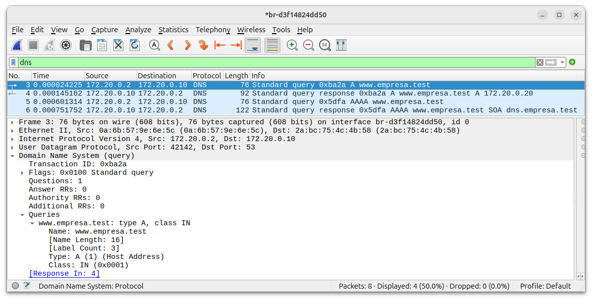
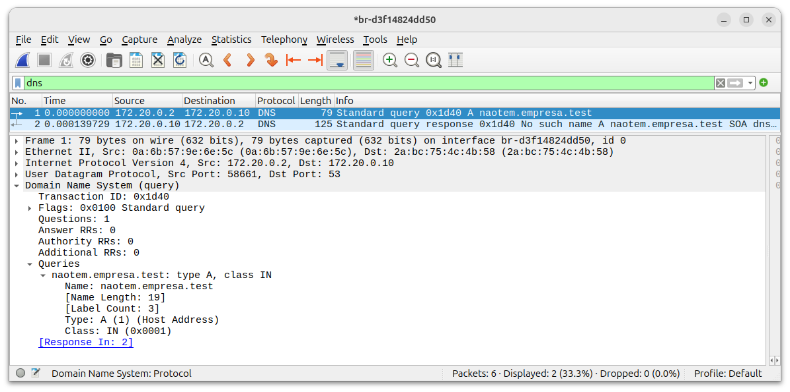
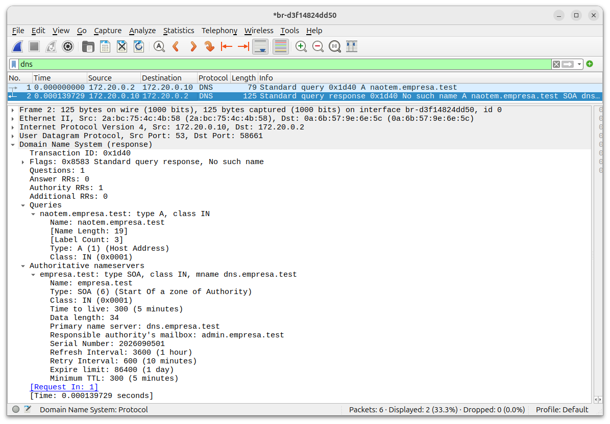
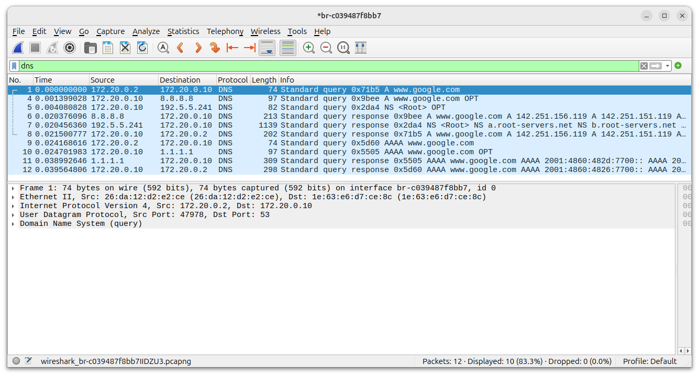
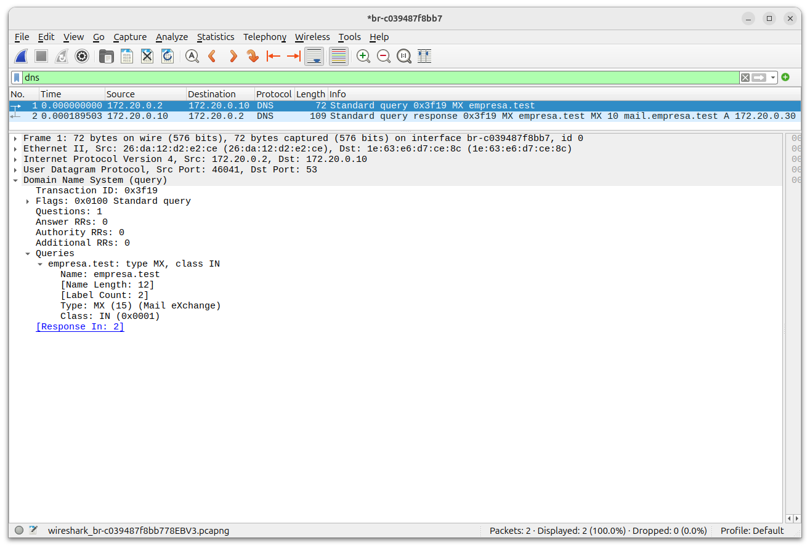
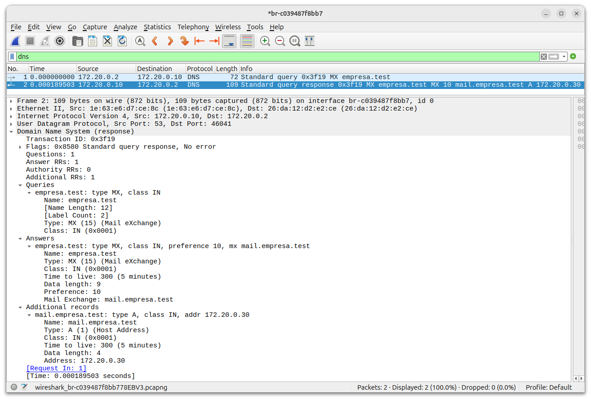

# Laboratório de DNS

Neste laboratório, vamos investigar como um host converte endereço em formato texto (FQDN - Fully Qualified Domain Name) em endereço IP e vice-versa.

Faremos consultas do tipo:
- A
- MX
- Consulta direta
- Consulta reversa

Vamos usar o **named** como servidor DNS na nossa rede local.

## Bibliografia

- [DNS - Terminologia](https://datatracker.ietf.org/doc/html/rfc9499)
- [DNS - Implementação](https://datatracker.ietf.org/doc/html/rfc1035)
- [named - site](https://www.isc.org/bind/)
- [named - repositório](https://gitlab.isc.org/isc-projects/bind9)
- [nslookup](https://learn.microsoft.com/en-us/windows-server/administration/windows-commands/nslookup)

## Procedimento

Suba os containers.

No host:

```
$ sudo docker compose up -d
```

Resultado esperado

```
$ sudo docker compose up -d
[+] Running 3/3
 ✔ Network dns_dns-net   Created                              0.1s 
 ✔ Container dns-server  Started                              0.4s 
 ✔ Container dns-client  Started                              0.4s 
```

Verifique se os containers estão no ar:

```
$ sudo docker ps -a
```

Resultado esperado:

```
$ sudo docker ps -a
CONTAINER ID   IMAGE               COMMAND                  CREATED         STATUS         PORTS            NAMES
4d7de0808d65   meslin/dns-client   "/bin/bash"              2 minutes ago   Up 2 minutes                    dns-client
ae78dd849be5   meslin/dns-server   "named -g -c /etc/bi…"   2 minutes ago   Up 2 minutes   53/tcp, 53/udp   dns-server
```

Verifique as redes existentes:

```
$ sudo docker network ls
```

Resultado esperado:

```
$ sudo docker network ls
NETWORK ID     NAME          DRIVER    SCOPE
626fb2ea3cb6   bridge        bridge    local
8034ff13b14f   dns_dns-net   bridge    local
1b5be87839cd   host          host      local
97f519bf0843   none          null      local
```

Verifique também a rede que foi criada:

```
$ sudo docker network inspect dns_dns-net
```

Resultado esperado:

```
 sudo docker network inspect dns_dns-net
[
    {
        "Name": "dns_dns-net",
        "Id": "8034ff13b14f52b08f52eab26c9cfa8224f71ef4f79db9749ca864dce6ff1331",
        "Created": "2026-09-05T09:26:54.423969666-03:00",
        "Scope": "local",
        "Driver": "bridge",
        "EnableIPv4": true,
        "EnableIPv6": false,
        "IPAM": {
            "Driver": "default",
            "Options": null,
            "Config": [
                {
                    "Subnet": "172.20.0.0/24",
                    "IPRange": "",
                    "Gateway": "172.20.0.1"
                }
            ]
        },
        "Internal": true,
        "Attachable": false,
        "Ingress": false,
        "ConfigFrom": {
            "Network": ""
        },
        "ConfigOnly": false,
        "Options": {},
        "Labels": {
            "com.docker.compose.config-hash": "9042241b33ba01349df1f33843f7332d254ee04d4ccd8704f695c6134c9012ed",
            "com.docker.compose.network": "dns-net",
            "com.docker.compose.project": "dns",
            "com.docker.compose.version": "2.40.3"
        },
        "Containers": {
            "4d7de0808d65a3437b4f03eba4412dd56abada4e5059afb6f76136ed001d7acb": {
                "Name": "dns-client",
                "EndpointID": "89e1c37070c286d9b5ba01f6a3ef8b3676b912261e74aad598b159d42f6786aa",
                "MacAddress": "8a:1f:09:00:09:96",
                "IPv4Address": "172.20.0.2/24",
                "IPv6Address": ""
            },
            "ae78dd849be53d4b6f165eadaa65f5f6fb59d1c3eca0798b1703c0064f8ad9e6": {
                "Name": "dns-server",
                "EndpointID": "ed3f8e2244190f778be1693d429038ad361f3ee3eb06d2b349fc337ea880ad1e",
                "MacAddress": "02:c7:a3:4b:8b:f5",
                "IPv4Address": "172.20.0.10/24",
                "IPv6Address": ""
            }
        },
        "Status": {
            "IPAM": {
                "Subnets": {
                    "172.20.0.0/24": {
                        "IPsInUse": 5,
                        "DynamicIPsAvailable": 251
                    }
                }
            }
        }
    }
]
```

Analise o log do servidor DNS.

No host:

```
$ sudo docker compose logs dns-server
```

Resultado esperado:

```
$ sudo docker compose logs dns-server
dns-server  | 05-Sep-2026 12:26:54.863 starting BIND 9.18.39-0ubuntu0.24.04.7-Ubuntu (Extended Support Version) <id:>
dns-server  | 05-Sep-2026 12:26:54.863 running on Linux x86_64 7.0.0-30-generic #30~24.04.1-Ubuntu SMP PREEMPT_DYNAMIC Fri Aug  7 13:27:52 UTC 2
dns-server  | 05-Sep-2026 12:26:54.863 built with  '--build=x86_64-linux-gnu' '--prefix=/usr' '--includedir=${prefix}/include' '--mandir=${prefix}/share/man' '--infodir=${prefix}/share/info' '--sysconfdir=/etc' '--localstatedir=/var' '--disable-option-checking' '--disable-silent-rules' '--libdir=${prefix}/lib/x86_64-linux-gnu' '--runstatedir=/run' '--disable-maintainer-mode' '--disable-dependency-tracking' '--libdir=/usr/lib/x86_64-linux-gnu' '--sysconfdir=/etc/bind' '--with-python=python3' '--localstatedir=/' '--enable-threads' '--enable-largefile' '--with-libtool' '--enable-shared' '--disable-static' '--with-gost=no' '--with-openssl=/usr' '--with-gssapi=yes' '--with-libidn2' '--with-json-c' '--with-lmdb=/usr' '--with-gnu-ld' '--with-maxminddb' '--with-atf=no' '--enable-ipv6' '--enable-rrl' '--enable-filter-aaaa' '--disable-native-pkcs11' 'build_alias=x86_64-linux-gnu' 'CFLAGS=-g -O2 -fno-omit-frame-pointer -mno-omit-leaf-frame-pointer -ffile-prefix-map=/build/bind9-8LYxaJ/bind9-9.18.39=. -flto=auto -ffat-lto-objects -fstack-protector-strong -fstack-clash-protection -Wformat -Werror=format-security -fcf-protection -fdebug-prefix-map=/build/bind9-8LYxaJ/bind9-9.18.39=/usr/src/bind9-1:9.18.39-0ubuntu0.24.04.7 -fno-strict-aliasing -fno-delete-null-pointer-checks -DNO_VERSION_DATE -DDIG_SIGCHASE' 'LDFLAGS=-Wl,-Bsymbolic-functions -flto=auto -ffat-lto-objects -Wl,-z,relro -Wl,-z,now -ledit' 'CPPFLAGS=-Wdate-time -D_FORTIFY_SOURCE=3'
dns-server  | 05-Sep-2026 12:26:54.863 running as: named -g -c /etc/bind/named.conf
dns-server  | 05-Sep-2026 12:26:54.863 compiled by GCC 13.3.0
dns-server  | 05-Sep-2026 12:26:54.863 compiled with OpenSSL version: OpenSSL 3.0.13 30 Jan 2024
dns-server  | 05-Sep-2026 12:26:54.863 linked to OpenSSL version: OpenSSL 3.0.13 30 Jan 2024
dns-server  | 05-Sep-2026 12:26:54.863 compiled with libuv version: 1.48.0
dns-server  | 05-Sep-2026 12:26:54.863 linked to libuv version: 1.48.0
dns-server  | 05-Sep-2026 12:26:54.864 compiled with libxml2 version: 2.9.14
dns-server  | 05-Sep-2026 12:26:54.864 linked to libxml2 version: 20914
dns-server  | 05-Sep-2026 12:26:54.864 compiled with json-c version: 0.17
dns-server  | 05-Sep-2026 12:26:54.864 linked to json-c version: 0.17
dns-server  | 05-Sep-2026 12:26:54.864 compiled with zlib version: 1.3
dns-server  | 05-Sep-2026 12:26:54.864 linked to zlib version: 1.3
dns-server  | 05-Sep-2026 12:26:54.864 ----------------------------------------------------
dns-server  | 05-Sep-2026 12:26:54.864 BIND 9 is maintained by Internet Systems Consortium,
dns-server  | 05-Sep-2026 12:26:54.864 Inc. (ISC), a non-profit 501(c)(3) public-benefit 
dns-server  | 05-Sep-2026 12:26:54.864 corporation.  Support and training for BIND 9 are 
dns-server  | 05-Sep-2026 12:26:54.864 available at https://www.isc.org/support
dns-server  | 05-Sep-2026 12:26:54.864 ----------------------------------------------------
dns-server  | 05-Sep-2026 12:26:54.864 found 12 CPUs, using 12 worker threads
dns-server  | 05-Sep-2026 12:26:54.864 using 12 UDP listeners per interface
dns-server  | 05-Sep-2026 12:26:54.870 DNSSEC algorithms: RSASHA1 NSEC3RSASHA1 RSASHA256 RSASHA512 ECDSAP256SHA256 ECDSAP384SHA384 ED25519 ED448
dns-server  | 05-Sep-2026 12:26:54.870 DS algorithms: SHA-1 SHA-256 SHA-384
dns-server  | 05-Sep-2026 12:26:54.870 HMAC algorithms: HMAC-MD5 HMAC-SHA1 HMAC-SHA224 HMAC-SHA256 HMAC-SHA384 HMAC-SHA512
dns-server  | 05-Sep-2026 12:26:54.870 TKEY mode 2 support (Diffie-Hellman): yes
dns-server  | 05-Sep-2026 12:26:54.870 TKEY mode 3 support (GSS-API): yes
dns-server  | 05-Sep-2026 12:26:54.872 the initial working directory is '/'
dns-server  | 05-Sep-2026 12:26:54.872 loading configuration from '/etc/bind/named.conf'
dns-server  | 05-Sep-2026 12:26:54.872 the working directory is now '/var/cache/bind'
dns-server  | 05-Sep-2026 12:26:54.872 reading built-in trust anchors from file '/etc/bind/bind.keys'
dns-server  | 05-Sep-2026 12:26:54.872 looking for GeoIP2 databases in '/usr/share/GeoIP'
dns-server  | 05-Sep-2026 12:26:54.872 using default UDP/IPv4 port range: [32768, 60999]
dns-server  | 05-Sep-2026 12:26:54.872 using default UDP/IPv6 port range: [32768, 60999]
dns-server  | 05-Sep-2026 12:26:54.873 listening on IPv4 interface lo, 127.0.0.1#53
dns-server  | 05-Sep-2026 12:26:54.882 listening on IPv4 interface eth0, 172.20.0.10#53
dns-server  | 05-Sep-2026 12:26:54.882 generating session key for dynamic DNS
dns-server  | 05-Sep-2026 12:26:54.883 sizing zone task pool based on 2 zones
dns-server  | 05-Sep-2026 12:26:54.883 none:99: 'max-cache-size 90%' - setting to 28753MB (out of 31948MB)
dns-server  | 05-Sep-2026 12:26:54.893 set up managed keys zone for view _default, file 'managed-keys.bind'
dns-server  | 05-Sep-2026 12:26:54.893 automatic empty zone: 10.IN-ADDR.ARPA
dns-server  | 05-Sep-2026 12:26:54.893 automatic empty zone: 16.172.IN-ADDR.ARPA
dns-server  | 05-Sep-2026 12:26:54.893 automatic empty zone: 17.172.IN-ADDR.ARPA
dns-server  | 05-Sep-2026 12:26:54.893 automatic empty zone: 18.172.IN-ADDR.ARPA
dns-server  | 05-Sep-2026 12:26:54.893 automatic empty zone: 19.172.IN-ADDR.ARPA
dns-server  | 05-Sep-2026 12:26:54.893 automatic empty zone: 21.172.IN-ADDR.ARPA
dns-server  | 05-Sep-2026 12:26:54.893 automatic empty zone: 22.172.IN-ADDR.ARPA
dns-server  | 05-Sep-2026 12:26:54.893 automatic empty zone: 23.172.IN-ADDR.ARPA
dns-server  | 05-Sep-2026 12:26:54.893 automatic empty zone: 24.172.IN-ADDR.ARPA
dns-server  | 05-Sep-2026 12:26:54.893 automatic empty zone: 25.172.IN-ADDR.ARPA
dns-server  | 05-Sep-2026 12:26:54.893 automatic empty zone: 26.172.IN-ADDR.ARPA
dns-server  | 05-Sep-2026 12:26:54.893 automatic empty zone: 27.172.IN-ADDR.ARPA
dns-server  | 05-Sep-2026 12:26:54.893 automatic empty zone: 28.172.IN-ADDR.ARPA
dns-server  | 05-Sep-2026 12:26:54.893 automatic empty zone: 29.172.IN-ADDR.ARPA
dns-server  | 05-Sep-2026 12:26:54.893 automatic empty zone: 30.172.IN-ADDR.ARPA
dns-server  | 05-Sep-2026 12:26:54.893 automatic empty zone: 31.172.IN-ADDR.ARPA
dns-server  | 05-Sep-2026 12:26:54.893 automatic empty zone: 168.192.IN-ADDR.ARPA
dns-server  | 05-Sep-2026 12:26:54.893 automatic empty zone: 64.100.IN-ADDR.ARPA
dns-server  | 05-Sep-2026 12:26:54.893 automatic empty zone: 65.100.IN-ADDR.ARPA
dns-server  | 05-Sep-2026 12:26:54.893 automatic empty zone: 66.100.IN-ADDR.ARPA
dns-server  | 05-Sep-2026 12:26:54.893 automatic empty zone: 67.100.IN-ADDR.ARPA
dns-server  | 05-Sep-2026 12:26:54.893 automatic empty zone: 68.100.IN-ADDR.ARPA
dns-server  | 05-Sep-2026 12:26:54.893 automatic empty zone: 69.100.IN-ADDR.ARPA
dns-server  | 05-Sep-2026 12:26:54.893 automatic empty zone: 70.100.IN-ADDR.ARPA
dns-server  | 05-Sep-2026 12:26:54.893 automatic empty zone: 71.100.IN-ADDR.ARPA
dns-server  | 05-Sep-2026 12:26:54.893 automatic empty zone: 72.100.IN-ADDR.ARPA
dns-server  | 05-Sep-2026 12:26:54.893 automatic empty zone: 73.100.IN-ADDR.ARPA
dns-server  | 05-Sep-2026 12:26:54.893 automatic empty zone: 74.100.IN-ADDR.ARPA
dns-server  | 05-Sep-2026 12:26:54.893 automatic empty zone: 75.100.IN-ADDR.ARPA
dns-server  | 05-Sep-2026 12:26:54.893 automatic empty zone: 76.100.IN-ADDR.ARPA
dns-server  | 05-Sep-2026 12:26:54.893 automatic empty zone: 77.100.IN-ADDR.ARPA
dns-server  | 05-Sep-2026 12:26:54.893 automatic empty zone: 78.100.IN-ADDR.ARPA
dns-server  | 05-Sep-2026 12:26:54.893 automatic empty zone: 79.100.IN-ADDR.ARPA
dns-server  | 05-Sep-2026 12:26:54.893 automatic empty zone: 80.100.IN-ADDR.ARPA
dns-server  | 05-Sep-2026 12:26:54.893 automatic empty zone: 81.100.IN-ADDR.ARPA
dns-server  | 05-Sep-2026 12:26:54.893 automatic empty zone: 82.100.IN-ADDR.ARPA
dns-server  | 05-Sep-2026 12:26:54.893 automatic empty zone: 83.100.IN-ADDR.ARPA
dns-server  | 05-Sep-2026 12:26:54.893 automatic empty zone: 84.100.IN-ADDR.ARPA
dns-server  | 05-Sep-2026 12:26:54.894 automatic empty zone: 85.100.IN-ADDR.ARPA
dns-server  | 05-Sep-2026 12:26:54.894 automatic empty zone: 86.100.IN-ADDR.ARPA
dns-server  | 05-Sep-2026 12:26:54.894 automatic empty zone: 87.100.IN-ADDR.ARPA
dns-server  | 05-Sep-2026 12:26:54.894 automatic empty zone: 88.100.IN-ADDR.ARPA
dns-server  | 05-Sep-2026 12:26:54.894 automatic empty zone: 89.100.IN-ADDR.ARPA
dns-server  | 05-Sep-2026 12:26:54.894 automatic empty zone: 90.100.IN-ADDR.ARPA
dns-server  | 05-Sep-2026 12:26:54.894 automatic empty zone: 91.100.IN-ADDR.ARPA
dns-server  | 05-Sep-2026 12:26:54.894 automatic empty zone: 92.100.IN-ADDR.ARPA
dns-server  | 05-Sep-2026 12:26:54.894 automatic empty zone: 93.100.IN-ADDR.ARPA
dns-server  | 05-Sep-2026 12:26:54.894 automatic empty zone: 94.100.IN-ADDR.ARPA
dns-server  | 05-Sep-2026 12:26:54.894 automatic empty zone: 95.100.IN-ADDR.ARPA
dns-server  | 05-Sep-2026 12:26:54.894 automatic empty zone: 96.100.IN-ADDR.ARPA
dns-server  | 05-Sep-2026 12:26:54.894 automatic empty zone: 97.100.IN-ADDR.ARPA
dns-server  | 05-Sep-2026 12:26:54.894 automatic empty zone: 98.100.IN-ADDR.ARPA
dns-server  | 05-Sep-2026 12:26:54.894 automatic empty zone: 99.100.IN-ADDR.ARPA
dns-server  | 05-Sep-2026 12:26:54.894 automatic empty zone: 100.100.IN-ADDR.ARPA
dns-server  | 05-Sep-2026 12:26:54.894 automatic empty zone: 101.100.IN-ADDR.ARPA
dns-server  | 05-Sep-2026 12:26:54.894 automatic empty zone: 102.100.IN-ADDR.ARPA
dns-server  | 05-Sep-2026 12:26:54.894 automatic empty zone: 103.100.IN-ADDR.ARPA
dns-server  | 05-Sep-2026 12:26:54.894 automatic empty zone: 104.100.IN-ADDR.ARPA
dns-server  | 05-Sep-2026 12:26:54.894 automatic empty zone: 105.100.IN-ADDR.ARPA
dns-server  | 05-Sep-2026 12:26:54.894 automatic empty zone: 106.100.IN-ADDR.ARPA
dns-server  | 05-Sep-2026 12:26:54.894 automatic empty zone: 107.100.IN-ADDR.ARPA
dns-server  | 05-Sep-2026 12:26:54.894 automatic empty zone: 108.100.IN-ADDR.ARPA
dns-server  | 05-Sep-2026 12:26:54.894 automatic empty zone: 109.100.IN-ADDR.ARPA
dns-server  | 05-Sep-2026 12:26:54.894 automatic empty zone: 110.100.IN-ADDR.ARPA
dns-server  | 05-Sep-2026 12:26:54.894 automatic empty zone: 111.100.IN-ADDR.ARPA
dns-server  | 05-Sep-2026 12:26:54.894 automatic empty zone: 112.100.IN-ADDR.ARPA
dns-server  | 05-Sep-2026 12:26:54.894 automatic empty zone: 113.100.IN-ADDR.ARPA
dns-server  | 05-Sep-2026 12:26:54.894 automatic empty zone: 114.100.IN-ADDR.ARPA
dns-server  | 05-Sep-2026 12:26:54.894 automatic empty zone: 115.100.IN-ADDR.ARPA
dns-server  | 05-Sep-2026 12:26:54.894 automatic empty zone: 116.100.IN-ADDR.ARPA
dns-server  | 05-Sep-2026 12:26:54.894 automatic empty zone: 117.100.IN-ADDR.ARPA
dns-server  | 05-Sep-2026 12:26:54.894 automatic empty zone: 118.100.IN-ADDR.ARPA
dns-server  | 05-Sep-2026 12:26:54.894 automatic empty zone: 119.100.IN-ADDR.ARPA
dns-server  | 05-Sep-2026 12:26:54.894 automatic empty zone: 120.100.IN-ADDR.ARPA
dns-server  | 05-Sep-2026 12:26:54.894 automatic empty zone: 121.100.IN-ADDR.ARPA
dns-server  | 05-Sep-2026 12:26:54.894 automatic empty zone: 122.100.IN-ADDR.ARPA
dns-server  | 05-Sep-2026 12:26:54.894 automatic empty zone: 123.100.IN-ADDR.ARPA
dns-server  | 05-Sep-2026 12:26:54.894 automatic empty zone: 124.100.IN-ADDR.ARPA
dns-server  | 05-Sep-2026 12:26:54.894 automatic empty zone: 125.100.IN-ADDR.ARPA
dns-server  | 05-Sep-2026 12:26:54.894 automatic empty zone: 126.100.IN-ADDR.ARPA
dns-server  | 05-Sep-2026 12:26:54.894 automatic empty zone: 127.100.IN-ADDR.ARPA
dns-server  | 05-Sep-2026 12:26:54.894 automatic empty zone: 0.IN-ADDR.ARPA
dns-server  | 05-Sep-2026 12:26:54.895 automatic empty zone: 127.IN-ADDR.ARPA
dns-server  | 05-Sep-2026 12:26:54.895 automatic empty zone: 254.169.IN-ADDR.ARPA
dns-server  | 05-Sep-2026 12:26:54.895 automatic empty zone: 2.0.192.IN-ADDR.ARPA
dns-server  | 05-Sep-2026 12:26:54.895 automatic empty zone: 100.51.198.IN-ADDR.ARPA
dns-server  | 05-Sep-2026 12:26:54.895 automatic empty zone: 113.0.203.IN-ADDR.ARPA
dns-server  | 05-Sep-2026 12:26:54.895 automatic empty zone: 255.255.255.255.IN-ADDR.ARPA
dns-server  | 05-Sep-2026 12:26:54.895 automatic empty zone: 0.0.0.0.0.0.0.0.0.0.0.0.0.0.0.0.0.0.0.0.0.0.0.0.0.0.0.0.0.0.0.0.IP6.ARPA
dns-server  | 05-Sep-2026 12:26:54.895 automatic empty zone: 1.0.0.0.0.0.0.0.0.0.0.0.0.0.0.0.0.0.0.0.0.0.0.0.0.0.0.0.0.0.0.0.IP6.ARPA
dns-server  | 05-Sep-2026 12:26:54.895 automatic empty zone: D.F.IP6.ARPA
dns-server  | 05-Sep-2026 12:26:54.895 automatic empty zone: 8.E.F.IP6.ARPA
dns-server  | 05-Sep-2026 12:26:54.895 automatic empty zone: 9.E.F.IP6.ARPA
dns-server  | 05-Sep-2026 12:26:54.895 automatic empty zone: A.E.F.IP6.ARPA
dns-server  | 05-Sep-2026 12:26:54.895 automatic empty zone: B.E.F.IP6.ARPA
dns-server  | 05-Sep-2026 12:26:54.895 automatic empty zone: 8.B.D.0.1.0.0.2.IP6.ARPA
dns-server  | 05-Sep-2026 12:26:54.895 automatic empty zone: EMPTY.AS112.ARPA
dns-server  | 05-Sep-2026 12:26:54.895 automatic empty zone: HOME.ARPA
dns-server  | 05-Sep-2026 12:26:54.895 automatic empty zone: RESOLVER.ARPA
dns-server  | 05-Sep-2026 12:26:54.904 configuring command channel from '/etc/bind/rndc.key'
dns-server  | 05-Sep-2026 12:26:54.904 open: /etc/bind/rndc.key: permission denied
dns-server  | 05-Sep-2026 12:26:54.904 command channel listening on 127.0.0.1#953
dns-server  | 05-Sep-2026 12:26:54.904 configuring command channel from '/etc/bind/rndc.key'
dns-server  | 05-Sep-2026 12:26:54.904 open: /etc/bind/rndc.key: permission denied
dns-server  | 05-Sep-2026 12:26:54.904 command channel listening on ::1#953
dns-server  | 05-Sep-2026 12:26:54.904 not using config file logging statement for logging due to -g option
dns-server  | 05-Sep-2026 12:26:54.905 managed-keys-zone: loaded serial 0
dns-server  | 05-Sep-2026 12:26:54.909 /etc/bind/db.172.20.0:17: file does not end with newline
dns-server  | 05-Sep-2026 12:26:54.909 zone 20.172.in-addr.arpa/IN: loaded serial 2026090501
dns-server  | 05-Sep-2026 12:26:54.913 /etc/bind/db.empresa.test:20: file does not end with newline
dns-server  | 05-Sep-2026 12:26:54.913 zone empresa.test/IN: loaded serial 2026090501
dns-server  | 05-Sep-2026 12:26:54.913 all zones loaded
dns-server  | 05-Sep-2026 12:26:54.913 running
```

### Entrar no cliente

No host:

```
$ sudo docker exec -it dns-client bash
```

Resultado esperado:

```
$ sudo docker exec -it dns-client bash
root@client:/# 
```

### FQDN fictício local

Consulte um FQDN fictício, por exemplo, verifique o endereço IP de `www.empresa.test`

Inicie a captura com o Wireshark.

No cliente:

```
root@client:/# nslookup www.empresa.test
```

Resultado esperado:

```
root@client:/# nslookup www.empresa.test
Server:		127.0.0.11
Address:	127.0.0.11#53

Name:	www.empresa.test
Address: 172.20.0.20
```
Ou para obter mais detalhes da consulta.

No Cliente:

```
root@client:/# nslookup -debug www.empresa.test
```

Resultado esperado:

```
root@client:/# nslookup -debug www.empresa.test
Server:		127.0.0.11
Address:	127.0.0.11#53

------------
    QUESTIONS:
	www.empresa.test, type = A, class = IN
    ANSWERS:
    ->  www.empresa.test
	internet address = 172.20.0.20
	ttl = 300
    AUTHORITY RECORDS:
    ADDITIONAL RECORDS:
------------
Name:	www.empresa.test
Address: 172.20.0.20
------------
    QUESTIONS:
	www.empresa.test, type = AAAA, class = IN
    ANSWERS:
    AUTHORITY RECORDS:
    ->  empresa.test
	origin = dns.empresa.test
	mail addr = admin.empresa.test
	serial = 2026090501
	refresh = 3600
	retry = 600
	expire = 86400
	minimum = 300
	ttl = 300
    ADDITIONAL RECORDS:
------------
```

Termine a captura.
Examine os resultados.

A *query*:



A *response*:


Consulte também o endereço do servidor de DNS da empresa.

No cliente:

```
root@client:/# nslookup -debug dns.empresa.test
```

Resultado esperado:

```
root@client:/# nslookup -debug dns.empresa.test
Server:		127.0.0.11
Address:	127.0.0.11#53

------------
    QUESTIONS:
	dns.empresa.test, type = A, class = IN
    ANSWERS:
    ->  dns.empresa.test
	internet address = 172.20.0.10
	ttl = 300
    AUTHORITY RECORDS:
    ADDITIONAL RECORDS:
------------
Name:	dns.empresa.test
Address: 172.20.0.10
------------
    QUESTIONS:
	dns.empresa.test, type = AAAA, class = IN
    ANSWERS:
    AUTHORITY RECORDS:
    ->  empresa.test
	origin = dns.empresa.test
	mail addr = admin.empresa.test
	serial = 2026090501
	refresh = 3600
	retry = 600
	expire = 86400
	minimum = 300
	ttl = 300
    ADDITIONAL RECORDS:
------------
```

### Consulta FQDN Local Inexistente

Consulte um FQDN inexistente.

Inicie a captura com o Wireshark.

No cliente:

```
root@client:/# nslookup -debug naotem.empresa.test
```

Resultado esperado:

```
root@client:/# nslookup -debug naotem.empresa.test
Server:		127.0.0.11
Address:	127.0.0.11#53

------------
    QUESTIONS:
	naotem.empresa.test, type = A, class = IN
    ANSWERS:
    AUTHORITY RECORDS:
    ->  empresa.test
	origin = dns.empresa.test
	mail addr = admin.empresa.test
	serial = 2026090501
	refresh = 3600
	retry = 600
	expire = 86400
	minimum = 300
	ttl = 300
    ADDITIONAL RECORDS:
------------
** server can't find naotem.empresa.test: NXDOMAIN
```

Termine a captura.
Analise os resultados.

A query:



A response:



### FQDN Externo

Agora consulte um FQDN fora da empresa.

Inicie a captura com o Wireshark.

No cliente:

```
root@client:/# nslookup -debug www.google.com
```

Resultado esperado:

```
root@client:/# nslookup -debug www.google.com     
Server:		127.0.0.11
Address:	127.0.0.11#53

------------
    QUESTIONS:
	www.google.com, type = A, class = IN
    ANSWERS:
    ->  www.google.com
	internet address = 142.251.154.119
	ttl = 52
    ->  www.google.com
	internet address = 142.251.151.119
	ttl = 52
    ->  www.google.com
	internet address = 142.251.156.119
	ttl = 52
    ->  www.google.com
	internet address = 142.251.153.119
	ttl = 52
    ->  www.google.com
	internet address = 142.251.150.119
	ttl = 52
    ->  www.google.com
	internet address = 142.251.152.119
	ttl = 52
    ->  www.google.com
	internet address = 142.251.155.119
	ttl = 52
    ->  www.google.com
	internet address = 142.251.157.119
	ttl = 52
    AUTHORITY RECORDS:
    ADDITIONAL RECORDS:
------------
Non-authoritative answer:
Name:	www.google.com
Address: 142.251.154.119
Name:	www.google.com
Address: 142.251.151.119
Name:	www.google.com
Address: 142.251.156.119
Name:	www.google.com
Address: 142.251.153.119
Name:	www.google.com
Address: 142.251.150.119
Name:	www.google.com
Address: 142.251.152.119
Name:	www.google.com
Address: 142.251.155.119
Name:	www.google.com
Address: 142.251.157.119
------------
    QUESTIONS:
	www.google.com, type = AAAA, class = IN
    ANSWERS:
    ->  www.google.com
	has AAAA address 2001:4860:482d:7700::
	ttl = 199
    ->  www.google.com
	has AAAA address 2001:4860:482b:7700::
	ttl = 199
    ->  www.google.com
	has AAAA address 2001:4860:4829:7700::
	ttl = 199
    ->  www.google.com
	has AAAA address 2001:4860:4826:7700::
	ttl = 199
    ->  www.google.com
	has AAAA address 2001:4860:4828:7700::
	ttl = 199
    ->  www.google.com
	has AAAA address 2001:4860:482c:7700::
	ttl = 199
    ->  www.google.com
	has AAAA address 2001:4860:482a:7700::
	ttl = 199
    ->  www.google.com
	has AAAA address 2001:4860:4827:7700::
	ttl = 199
    AUTHORITY RECORDS:
    ADDITIONAL RECORDS:
------------
Name:	www.google.com
Address: 2001:4860:482d:7700::
Name:	www.google.com
Address: 2001:4860:482b:7700::
Name:	www.google.com
Address: 2001:4860:4829:7700::
Name:	www.google.com
Address: 2001:4860:4826:7700::
Name:	www.google.com
Address: 2001:4860:4828:7700::
Name:	www.google.com
Address: 2001:4860:482c:7700::
Name:	www.google.com
Address: 2001:4860:482a:7700::
Name:	www.google.com
Address: 2001:4860:4827:7700::

root@client:/# ifconfig 
eth0: flags=4163<UP,BROADCAST,RUNNING,MULTICAST>  mtu 1500
        inet 172.20.0.2  netmask 255.255.255.0  broadcast 172.20.0.255
        ether 26:d1:14:ba:19:ad  txqueuelen 0  (Ethernet)
        RX packets 105  bytes 11636 (11.6 KB)
        RX errors 0  dropped 0  overruns 0  frame 0
        TX packets 32  bytes 1876 (1.8 KB)
        TX errors 0  dropped 0 overruns 0  carrier 0  collisions 0

lo: flags=73<UP,LOOPBACK,RUNNING>  mtu 65536
        inet 127.0.0.1  netmask 255.0.0.0
        inet6 ::1  prefixlen 128  scopeid 0x10<host>
        loop  txqueuelen 1000  (Local Loopback)
        RX packets 28  bytes 2484 (2.4 KB)
        RX errors 0  dropped 0  overruns 0  frame 0
        TX packets 28  bytes 2484 (2.4 KB)
        TX errors 0  dropped 0 overruns 0  carrier 0  collisions 0
```

Termine a captura.
Analise os resultados.

Primeiro, observe a sequência de consultas (query) e respostas (response).



1. (1) Cliente 172.20.0.2 > Servidor 172.20.0.10: Qual é o IPv4 de www.google.com?
1. (4) Servidor 172.20.0.10 > Resolver Recursivo 8.8.8.8: Qual é o IPv4 de www.google.com?
1. (5) Servidor 172.20.0.10 > F-root 192.5.5.241: Quais são os servidores da raiz? (note que essa consulta foi efetuada em paralelo com a anterior)
1. (6) Resolver Recursivo 8.8.8.8 > Servidor 172.20.0.10: Estes são os endereços IPv4 de www.google.com.
1. (7) F-root 192.5.5.241 > Servidor 172.20.0.10: Estes são os servidores da raiz. 
1. (8) Resolver Recursivo 8.8.8.8 > Cliente 172.20.0.2: Estes são os endereços IPv4 de www.google.com.
1. (9) Cliente 172.20.0.2 > Servidor 172.20.0.10: Qual é o IPv6 de www.google.com?
1. (10) Servidor 172.20.0.10 > Resolver Recursivo 1.1.1.1: Qual é o IPv6 de www.google.com? (em round-robin)
1. (11) Resolver Recursivo 1.1.1.1 > Servidor 172.20.0.10: Estes são os endereços IPv6 de www.google.com.
1. (12) Servidor 172.20.0.10 > Cliente 172.20.0.2: Estes são os endereços IPv6 de www.google.com.

Expanda cada um dos datagramas capturados e examine o payload da aplicação (Domain Name System).

### Consulta MX

As consultas anteriores foram a registros do tipo A e AAAA.
Vamos fazer consultas a registros do tipo MX (correio).
Primeiro para o servidor de correio da empresa.

Inicie a captura com o Wireshark.

No cliente:

```
root@client:/# nslookup -debug -type=MX empresa.test
```

Resultado esperado:

```
root@client:/# nslookup -debug -type=MX empresa.test
Server:		127.0.0.11
Address:	127.0.0.11#53

------------
    QUESTIONS:
	empresa.test, type = MX, class = IN
    ANSWERS:
    ->  empresa.test
	mail exchanger = 10 mail.empresa.test.
	ttl = 300
    AUTHORITY RECORDS:
    ADDITIONAL RECORDS:
    ->  mail.empresa.test
	internet address = 172.20.0.30
	ttl = 300
------------
empresa.test	mail exchanger = 10 mail.empresa.test.
```

Termine a captura.
Analise os resultados.

A *query*:



A *response*:



> [!NOTE]
> Observe que a resposta apenas apresenta o FQDN do servidor de correio. Para saber o endereço IP, devemos fazer uma consulta do tipo A ou AAAA.

Agora, para um servidor de correio externo.

No cliente:

```
root@client:/# nslookup -debug -type=MX gmail.com
```

Resultado esperado:

```
root@client:/# nslookup -debug -type=MX gmail.com   
Server:		127.0.0.11
Address:	127.0.0.11#53

------------
    QUESTIONS:
	gmail.com, type = MX, class = IN
    ANSWERS:
    ->  gmail.com
	mail exchanger = 30 alt3.gmail-smtp-in.l.google.com.
	ttl = 2429
    ->  gmail.com
	mail exchanger = 40 alt4.gmail-smtp-in.l.google.com.
	ttl = 2429
    ->  gmail.com
	mail exchanger = 5 gmail-smtp-in.l.google.com.
	ttl = 2429
    ->  gmail.com
	mail exchanger = 10 alt1.gmail-smtp-in.l.google.com.
	ttl = 2429
    ->  gmail.com
	mail exchanger = 20 alt2.gmail-smtp-in.l.google.com.
	ttl = 2429
    AUTHORITY RECORDS:
    ADDITIONAL RECORDS:
------------
Non-authoritative answer:
gmail.com	mail exchanger = 30 alt3.gmail-smtp-in.l.google.com.
gmail.com	mail exchanger = 40 alt4.gmail-smtp-in.l.google.com.
gmail.com	mail exchanger = 5 gmail-smtp-in.l.google.com.
gmail.com	mail exchanger = 10 alt1.gmail-smtp-in.l.google.com.
gmail.com	mail exchanger = 20 alt2.gmail-smtp-in.l.google.com.

Authoritative answers can be found from:
```

## Resultados

- Compare uma consulta A com uma AAAA
- Obtenha o endereço IP do seu correio
- Quais são os FQDNs dos root-servers do DNS?
- Quais são os endereços IP dos root-servers do DNS?
- Faça duas consultas em sequência a um mesmo FQDN e analise as diferenças
- Faça duas consultas em sequência a um mesmo FQDN, mas de dois clientes diferentes e, novamente, analise as diferenças
