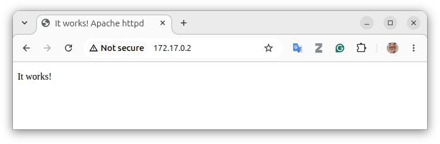
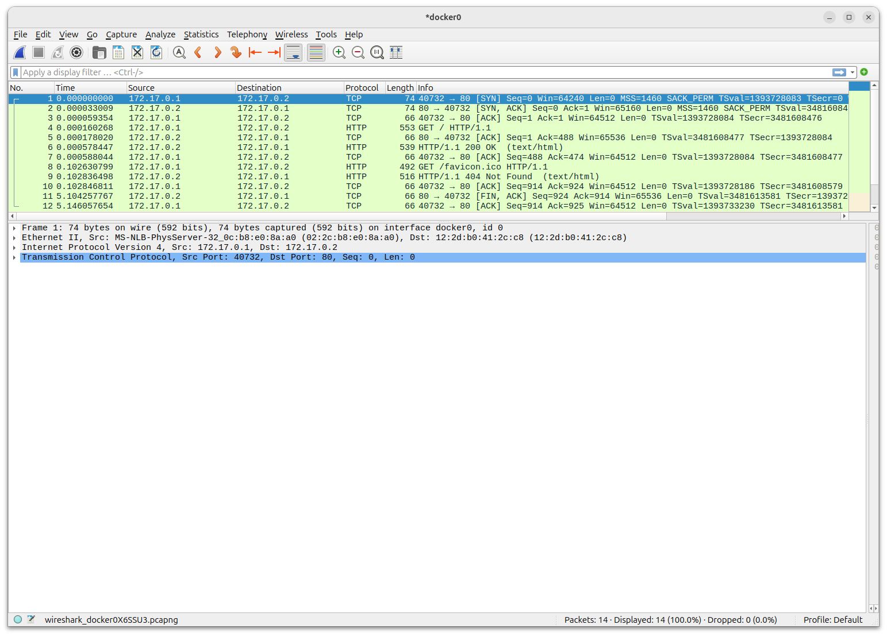
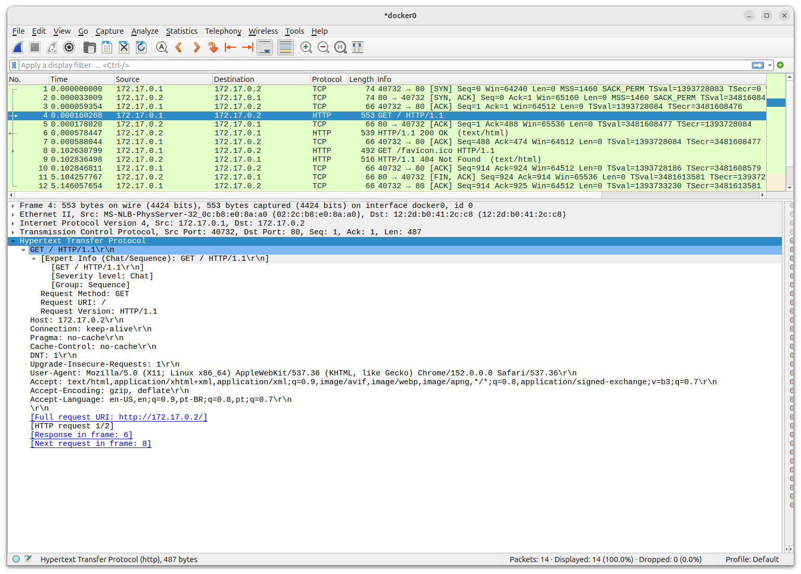
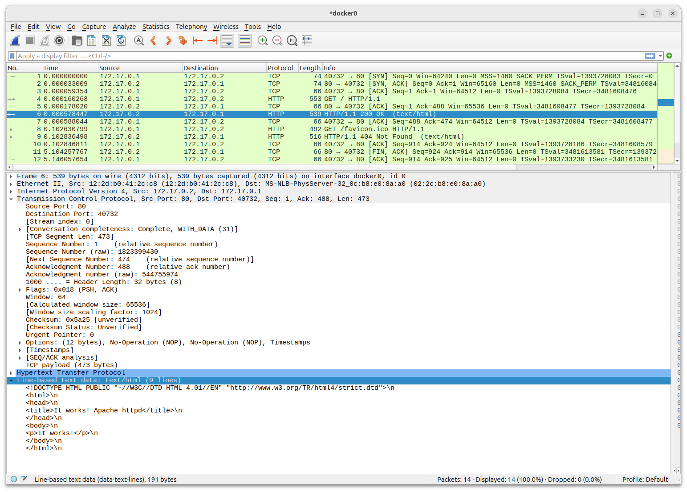
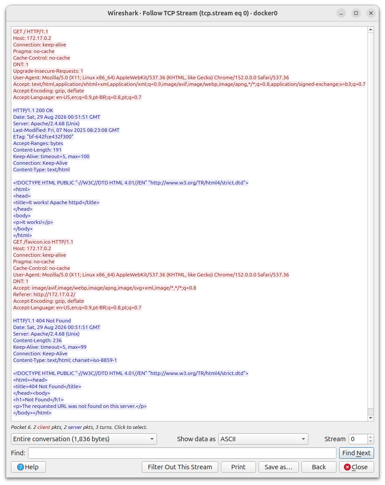

# Laboratório de HTTP

Nesse laboratório vamos observar todo o processo de uma requisição HTTP, desde o estabelecimento da conexão TCP até a resposta do servidor HTTP, o Apache, no nosso caso.

## Requisitos

- Docker
- Wireshark
- cURL
- Navegador

## Procedimento

1. Criar o container Apache
1. Verificar o funcionamento
1. Monitorar uma requisição HTTP

### Criar um servidor Apache

Para o servidor HTTP, vamos usar uma imagem oficial do Apache HTTP Server ([The Apache HTTP Server Project](https://hub.docker.com/_/httpd)).

Crie o container baseado no servidor Apache:

```bash
$ sudo docker run -d --name apache-http httpd
```

### Testes iniciais

Verifique se o container está rodando:

```bash
$ sudo docker ps -a
```

Resultado esperado:

```bash
$ sudo docker ps -a
CONTAINER ID   IMAGE     COMMAND              CREATED          STATUS          PORTS     NAMES
3810a5a8085a   httpd     "httpd-foreground"   10 minutes ago   Up 10 minutes   80/tcp    apache-http

```

Obtenha o endereço IP do servidor:

```bash
$ sudo docker inspect -f '{{range .NetworkSettings.Networks}}{{.IPAddress}}{{end}}' apache-http
 ```

Resultado esperado:

```bash
$ sudo docker inspect -f '{{range .NetworkSettings.Networks}}{{.IPAddress}}{{end}}' apache-http
172.17.0.2
```

Teste da conexão HTTP.
Use o cURL para obter uma pagina HTML do servidor Apache.
A opção `-i` mostra o cabeçalho HTTP da resposta (*response*).

> [!IMPORTANT]
> Lembre-se de trocar o endereço IP pelo obtido um pouco antes por você.

```bash
$ curl -i http://172.17.0.2
```

Resultado esperado:

```bash
$ curl -i http://172.17.0.2
HTTP/1.1 200 OK
Date: Fri, 28 Aug 2026 23:33:02 GMT
Server: Apache/2.4.68 (Unix)
Last-Modified: Fri, 07 Nov 2025 08:23:08 GMT
ETag: "bf-642fce432f300"
Accept-Ranges: bytes
Content-Length: 191
Content-Type: text/html

<!DOCTYPE HTML PUBLIC "-//W3C//DTD HTML 4.01//EN" "http://www.w3.org/TR/html4/strict.dtd">
<html>
<head>
<title>It works! Apache httpd</title>
</head>
<body>
<p>It works!</p>
</body>
</html>
```

### Captura dos datagramas

1. Inicie o Wireshark.

1. Selecione a interface do Docker.

1. Inicie a captura.

1. Pare a captura ao terminar de receber a página HTML



### Análise da captura

Verifique se a sua captura começa com o pedido de conexão do seu navegador, incluindo o handshake triplo e a finalização da conexão:



Analise o pedido da página HTML:



Analise a resposta HTTP:



Clique em qualquer parte da conversação com o botão direito do mouse e selecione `Follow`, `TCP Stream`:



### Dados obtidos

1. Compare o header exibido pelo comando `cURL` com o que foi capturado pelo Wireshark.

1. Verifique quantos pedidos (`request`) HTTP foram feitos em cada conexão.

1. Quais foram os recursos pedidos em cada *request*?

1. Liste o endereço origem e destino, assim como as portas origem e destino, de cada transação. Identifique quando a origem foi o host ou o servidor no container.
