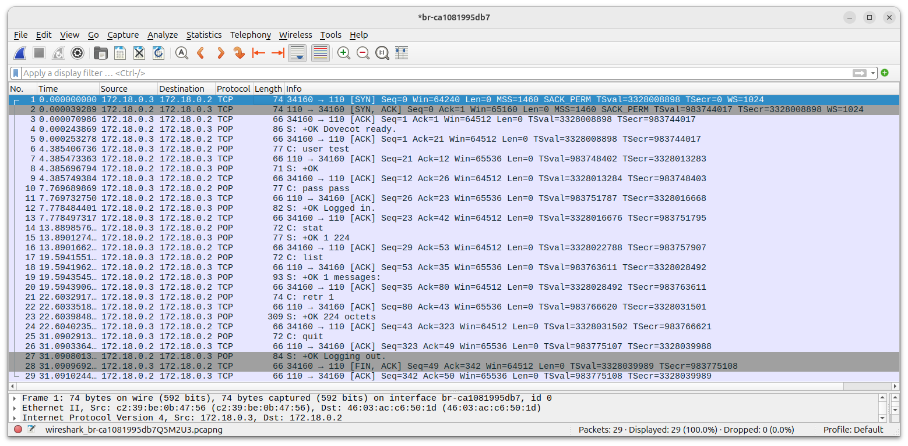
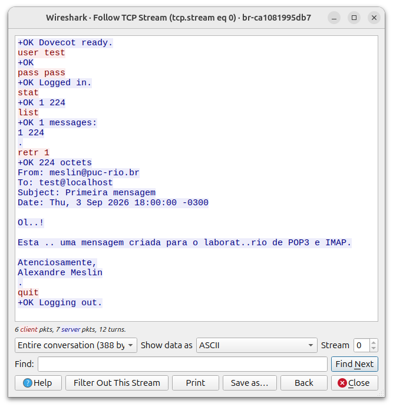

# Laboratório de POP3

Nesse laboratório vamos examinar conexões e troca de mensagens entre clientes e servidors POP3 (Post Office Protocol version 3).

Para esse laboratório vamos usar o servidor [Dovecot](https://dovecot.org/) para o correio.

Como cliente, usaremos o telnet para podermos capturar e analisar os datagramas sem interferência de criptografia.

## Requisitos

- Docker
- Wireshark

## Bibliografia

- [Site Dovecot](https://dovecot.org/)
- [Imagem Dovecot](https://hub.docker.com/r/dovecot/dovecot/)
- [Repositório Dovecot](https://github.com/dovecot/docker)
- [POP3](https://datatracker.ietf.org/doc/html/rfc1939)

## Procedimento

Vá para o diretório `Pratica/Correio/` e suba os containers:

No host:

```bash
$ sudo docker compose up -d
```

Resultado esperado:

```bash
$ sudo docker compose up -d
[+] Running 2/2
 ✔ Container mail-server  Started                                         0.4s 
 ✔ Container mail-client  Started                                             
```

Verifique se os containers estão no ar:

No host:

```bash
$ sudo docker ps -a
```

Resultado esperado:

```bash
$ sudo docker ps -a
CONTAINER ID   IMAGE                        COMMAND                  CREATED         STATUS         PORTS                                                           NAMES
0c21c3f26c49   dovecot/dovecot:2.3-latest   "/usr/bin/tini -- /u…"   3 minutes ago   Up 3 minutes   24/tcp, 110/tcp, 143/tcp, 587/tcp, 990/tcp, 993/tcp, 4190/tcp   mail-server
3fd5f5a8702a   meslin/mail-client:latest    "/bin/bash"              3 minutes ago   Up 3 minutes              
```

Verifique os endereços dos containers:

No host:

```bash
$ sudo docker network inspect correio_mail-net
```

Resultado esperado:

```bash
$ sudo docker network inspect correio_mail-net
[
    {
        "Name": "correio_mail-net",
        "Id": "ca1081995db797fb9ea4f9a2e3b8518d51c0fef42ba941b09cfad9fe63da294a",
        "Created": "2026-09-03T19:24:55.556407612-03:00",
        "Scope": "local",
        "Driver": "bridge",
        "EnableIPv4": true,
        "EnableIPv6": false,
        "IPAM": {
            "Driver": "default",
            "Options": null,
            "Config": [
                {
                    "Subnet": "172.18.0.0/24",
                    "IPRange": "",
                    "Gateway": "172.18.0.1"
                }
            ]
        },
        "Internal": false,
        "Attachable": false,
        "Ingress": false,
        "ConfigFrom": {
            "Network": ""
        },
        "ConfigOnly": false,
        "Options": {},
        "Labels": {
            "com.docker.compose.config-hash": "f2449e0e458dcdddfdc846f2af7c9b3c394006e4174811135641f5647aeaba75",
            "com.docker.compose.network": "mail-net",
            "com.docker.compose.project": "correio",
            "com.docker.compose.version": "2.40.3"
        },
        "Containers": {
            "0c21c3f26c498f6b532b86049351ac4baa1b54b0563a8c5665aa4096d26f9c89": {
                "Name": "mail-server",
                "EndpointID": "f7e9f333f3e0c4150ce0036fdd06ee5db189e6dc3d5cca44f9fdab9e6797a285",
                "MacAddress": "d6:61:11:f0:f8:b9",
                "IPv4Address": "172.18.0.2/24",
                "IPv6Address": ""
            },
            "3fd5f5a8702a5435faef1f5e773e5123fb8bea1238c8681b856b48fcdeed6fca": {
                "Name": "mail-client",
                "EndpointID": "2cf03c63667b00dbc1df6c69bf535d21933b1c3f73fc7d291adcec5df43dc872",
                "MacAddress": "c2:39:be:0b:47:56",
                "IPv4Address": "172.18.0.3/24",
                "IPv6Address": ""
            }
        },
        "Status": {
            "IPAM": {
                "Subnets": {
                    "172.18.0.0/24": {
                        "IPsInUse": 5,
                        "DynamicIPsAvailable": 251
                    }
                }
            }
        }
    }
]
```

No exemplo, o servidor tem o endereço IP 172.18.0.2/24 e o cliente 172.18.0.3/24.
Apenas confirme os valores porque a conexão será executada pelo FQDN do servidor via DNS do Docker.

Anote os 12 primeiros caracteres do ID da rede.
Nesse exemplo, o ID é "Id": "ca1081995db797fb9ea4f9a2e3b8518d51c0fef42ba941b09cfad9fe63da294a".
O nome da rede Linux criada é formada por `br-<12 primeiros caracteres>`, ou seja, `br-ca1081995db7`.
Verifique o seu nome de rede para poder iniciar a captura com o Wireshark.

### Gerando uma mensagem de correio

Crie uma mensagem de correio:

```bash
$ cat test_mail.txt | sudo docker exec -i mail-server doveadm save -u test
```

Verifique se existem mensagens:

```bash
$ sudo docker exec -i mail-server doveadm mailbox status -u test "messages unseen" INBOX
INBOX messages=2 unseen=2
```

### Início da Captura

Através do Wireshark, inicie a captura na interface de rede `br-ca1081995db7` (substitua pela sua interface, vista um pouco acima).

### Acesso ao servidor POP3 via cliente

Conectar no container do cliente POP3 através do seu host.

No host:

```bash
$ sudo docker compose exec mail-client bash
```

Resultado esperado:

```bash
$ sudo docker compose exec mail-client bash
root@mail-client:/# 
```

Dentro do container do cliente, conectar via telnet no servidor POP3:

No container mail-client:

```bash
root@mail-client:/# telnet mail-server 110
```

Resultado esperado:

```bash
root@mail-client:/# telnet mail-server 110
Trying 172.18.0.2...
Connected to mail-server.
Escape character is '^]'.
+OK Dovecot ready.
```

> [!INFO]
> Para sair do `telnet` digite `quit`.

Entre com o usuário `test` com as seguintes credenciais:
- Username: `test`
- Password: `pass`

No cliente:

```bash
user test
+OK
pass pass
+OK Logged in.
```

Verifique o status resumido da caixa postal com o comando `stat`:

```bash
stat
+OK 1 224
```

Verifique a quantidade de mensagens com o comando `list`:

```bash
list
+OK 1 messages:
1 224
.
```

Nesse exemplo temos apenas uma mensagem, a de número 1.
Exiba a mensagem com o comando `retr 1` (substitua o número `1` pelo número da mensagem que você quer exibir):

```bash
retr 1
+OK 224 octets
From: meslin@puc-rio.br
To: test@localhost
Subject: Primeira mensagem
Date: Thu, 3 Sep 2026 18:00:00 -0300

Olá!

Esta é uma mensagem criada para o laboratório de POP3 e IMAP.

Atenciosamente,
Alexandre Meslin
.
```

Termine a sessão com o comando `quit`

```bash
quit
+OK Logging out.
Connection closed by foreign host.
root@mail-client:/# 
```

### Término da captura

Termine a captura no Wireshark.

## Resultados



Clique com o botão direito do mouse no primeiro `SYN` e selecione `Follow`, `TCP Stream`.

Examine os dados da sessão:



## Dados Obtidos

Liste os dados obtidos pela sua captura da sessão :
- Flags que foram utilizadas no handshake triplo
- Flags que foram utilizadas no término da conexão
- Endereço IP do cliente
- Endereço IP do servidor
- Porta TCP do cliente
- Porta TCP do servidor
- Quem enviou a primeira mensagem da camada de aplicação
- A quantidade de pacotes enviados em cada direção

# Grande Desafio!

Use o exemplo do cliente socket e crie um cliente de e-mail POP3.
