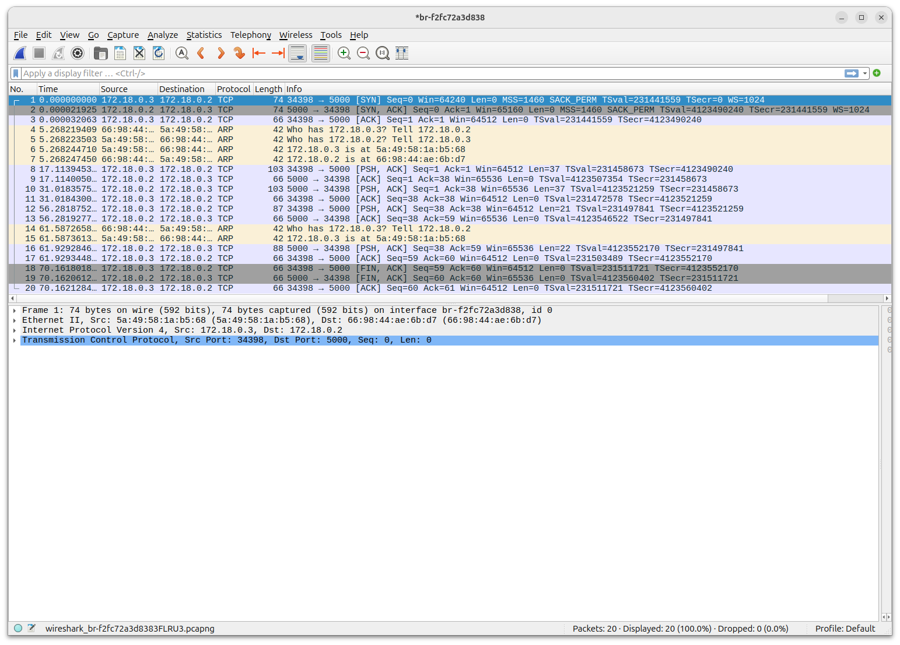
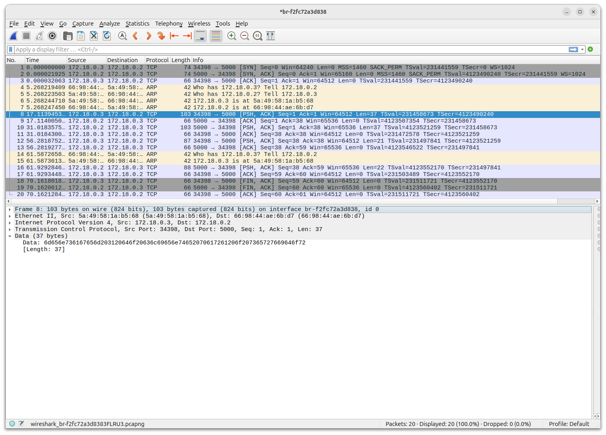
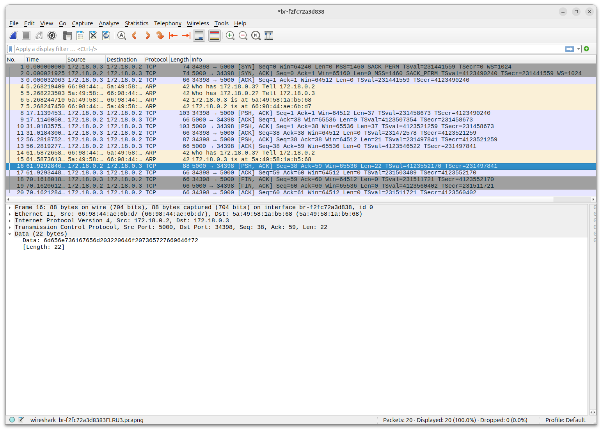

# Laboratório de Socket

Nesse laboratório vamos monitorar e analisar uma conexão TCP com soquetes entre um cliente e um servidor escritos em Python.

Tanto o cliente quanto o servidor serão executados dentro de um container Docker.

## Requisitos

- Docker
- Plugin Compose para Docker
- Wireshark

## Procedimento

### Preparando o ambiente

Vá para o diretório Socket.

Crie os containers e a rede a partir do arquivo `docker-compose.yaml`:

```bash
$ sudo docker compose up -d
```

Verifique se os containers estão rodando:

```bash
$ sudo docker ps -a
```

Resultado esperado:

```bash
$ sudo docker ps -a
CONTAINER ID   IMAGE                         COMMAND       CREATED         STATUS         PORTS     NAMES
a99513b38c5e   meslin/socket-server:1.1      "/bin/bash"   4 minutes ago   Up 4 minutes             socket-server
e3ea8c9734e7   meslin/socket-client:latest   "/bin/bash"   4 minutes ago   Up 4 minutes             socket-client
```

Verifique a rede:

```bash
$ sudo docker network ls
```

Resultado esperado:

```bash
$ sudo docker network ls
NETWORK ID     NAME                DRIVER    SCOPE
1d54afbd877b   bridge              bridge    local
1b5be87839cd   host                host      local
97f519bf0843   none                null      local
f2fc72a3d838   socket_socket-net   bridge    local
```

No meu exemplo, o nome da rede é `socket_socket-net` resultante da combinação do nome do diretório com o nome da rede.
Verifique o nome da sua rede.

Verifique os hosts conectados à essa rede:

```bash
$ sudo docker network inspect socket_socket-net
```

Resultado esperado:

```bash
$ sudo docker network inspect socket_socket-net
[
    {
        "Name": "socket_socket-net",
        "Id": "f2fc72a3d8382ffa806f31e778b5fc4550ed7881d5e98fc50dd4eec6a28d9511",
        "Created": "2026-08-30T18:42:18.547003763-03:00",
        "Scope": "local",
        "Driver": "bridge",
        "EnableIPv4": true,
        "EnableIPv6": false,
        "IPAM": {
            "Driver": "default",
            "Options": null,
            "Config": [
                {
                    "Subnet": "172.18.0.0/16",
                    "IPRange": "",
                    "Gateway": "172.18.0.1"
                }
            ]
        },
        "Internal": true,
        "Attachable": false,
        "Ingress": false,
        "ConfigFrom": {
            "Network": ""
        },
        "ConfigOnly": false,
        "Options": {},
        "Labels": {
            "com.docker.compose.config-hash": "43d3eff0552688e5b2e6518d633695d42fd75877ab3ade420981e51d7d2bdd6b",
            "com.docker.compose.network": "socket-net",
            "com.docker.compose.project": "socket",
            "com.docker.compose.version": "2.40.3"
        },
        "Containers": {
            "a99513b38c5e4a6fccd81d002c6bb2022c0370e55255639de6063cbc45c90fca": {
                "Name": "socket-server",
                "EndpointID": "1af4eeec2ff37145c350bfe87aafdeb693b42cfe0761dd48b26a33490da1a277",
                "MacAddress": "66:98:44:ae:6b:d7",
                "IPv4Address": "172.18.0.2/16",
                "IPv6Address": ""
            },
            "e3ea8c9734e79957b3d2f80cdcf1eca092e39c35b8b5ade8d5dee9fc21f65eb6": {
                "Name": "socket-client",
                "EndpointID": "f2372f50bf967202412d58fac22ac3b4e0efc4fec4ac9903ff5baf4f37878ff6",
                "MacAddress": "5a:49:58:1a:b5:68",
                "IPv4Address": "172.18.0.3/16",
                "IPv6Address": ""
            }
        },
        "Status": {
            "IPAM": {
                "Subnets": {
                    "172.18.0.0/16": {
                        "IPsInUse": 5,
                        "DynamicIPsAvailable": 65531
                    }
                }
            }
        }
    }
]
```

No exemplo, o servidor tem o endereço IP 172.18.0.2/16 e o cliente 172.18.0.3/16.
Apenas confirme os valores porque a conexão será executada pelo nome do host via DNS do Docker.

Anote os 12 primeiros caracteres do ID da rede.
Nesse exemplo, o ID é "Id": "f2fc72a3d8382ffa806f31e778b5fc4550ed7881d5e98fc50dd4eec6a28d9511".
O nome da rede Linux criada é formada por `br-<12 primeiros caracteres>`, ou seja, `br-f2fc72a3d838`.
Verifique o seu nome de rede para poder iniciar a captura com o Wireshark.

### Iniciando a captura

Abra o Wireshark, selecione a sua rede e inicie a captura.

### Executando o servidor

Abra um novo terminal e entre no container do servidor:

```bash
$ sudo docker compose exec server bash
```

Execute o programa servidor em Python:

Dentro do container `socket-server`:

```bash
root@server:/app# python3 server.py
```

### Executando o cliente

Abra um terceiro terminal e entre no container do cliente: 

```bash
$ sudo docker compose exec client bash
```

Execute o programa cliente em Python: 

Dentro do container `socket-client`:

```bash
root@client:/app# python3 client.py 
```

### Enviando mensagens

Envie mensagens do cliente para o servidor e vice-versa alternadamente.
Veja no Wireshark a captura de cada mensagem.
Para terminar, digite `sair` como mensagem no cliente.
Espere a flag de FIN na captura do Wireshark para terminar a captura.



Veja as mensagens enviadas durante a conexão.

Exemplo de mensagem enviada do cliente para o servidor:



Exemplo de mensagem enviada do servidor para o cliente:



## Dados obtidos

Utilizando a sua captura, verifique:

- Quem iniciou a conversação (enviou o primeiro SYN)?

- Qual o valor inicial do *Sequence Number* do cliente e do servidor?

- Verifique o valor do *Sequence Number* do cliente e do servidor depois de cada envio de mensagem.

- Envie uma mensagem e entenda o valor do seu *payload*.

## Comandos interessantes

- Para parar e remover os containers:

```bash
$ sudo docker compose down
```
